# 第五章 Hack汇编和机器码

## 1. The fetch-execute cycle

核心：CPU = 每个时钟周期做一次 fetch-execute cycle

### 1.1 Hack 计算机整体结构
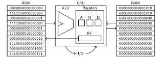

- 左边：ROM（read-only memory，只读存储器）里面存放的是 程序的指令（机器码，16-bit）
- 右边：RAM（random access memory，随机存取存储器），32KB 数据内存，按 16-bit word 编址，里面存的是 数据（比如变量、数组、结果等）
- 中间：CPU，里面有：
  - ALU：Arithmetic Logic Unit算术逻辑单元，负责 +、-、& 之类的运算。
  - Registers 寄存器：小而快的存储单元，包括：
    - PC（Program Counter）程序计数器：存着「下一条要执行的指令」在 ROM 里的地址
    - A、D、M 这几个特殊寄存器（后面几周会详细讲）
- 旁边：I/O 输入输出。Hack 里主要是 键盘 + 屏幕，之后会讲如何通过内存映射来操作。

### 1.2 Fetch-execute cycle（取指-执行周期）

几乎所有 CPU 都遵循这个逻辑，在 Hack 里，一次「时钟周期（clock cycle）」里，大致发生：
1. Fetch（取指）
   - CPU 看一眼 PC 里的值，比如 0。
   - 用这个数字当作 ROM 的地址，从 ROM 里读出那一行 16 位指令。
   - 这条 16 位机器码进入 CPU 内部。
2. Decode & Execute（译码 + 执行）
    - CPU 内部的组合逻辑「解读」这 16 位：什么操作？是「把 0 放到 A」？还是「D = D + M」？
    - 然后：可能从 RAM 里读数据（通过 A/M 寄存器），把数据送进 ALU 做计算，把结果写回寄存器或 RAM，可能还会修改 PC（比如跳转到别的指令地址）。
3. PC 更新
   - 如果这条指令没有特殊要求，PC 默认 +1，指向下一条指令；
   - 如果是跳转指令，PC 会被设置成别的值（比如 8），就不按顺序往下走了。

### 1.3 例子：算 RAM[0] + RAM[1] + 17，存到 RAM[2]
假设：

```asm
RAM[0] = 10
RAM[1] = 42
```

程序要做的事：计算 RAM[0] + RAM[1] + 17，并把结果写入 RAM[2]。
1. 步骤1：让 A 指向 RAM[0]

    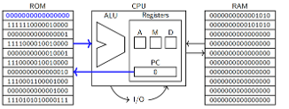
    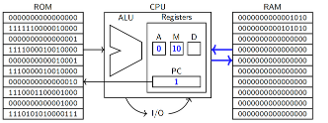

指令含义：`A = 0（把 0 存进 A 寄存器）`

结果：
1. `A = 0`
2. M 寄存器永远表示 RAM[A] 的值，所以现在 `M = RAM[0] = 10`
3. PC 自动从 0 变成 1。
:::danger 重要程度：※※※※
记住一句话：M ≈ RAM[A] 的「别名」。
只要你改 A，M 对应的 RAM 位置就跟着变。
:::
---
2. 步骤2：把 RAM[0] 复制到 D

    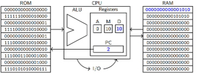

指令含义：D = M
结果：
- `D = 10`
- A 还是 0，M 还是 10。
- PC 从 1 变成 2。
- 现在：D 里保存了第一个数 RAM[0]，计划：后来再不断往 D 上加东西。
---
3. 步骤3：A = 1

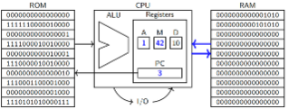

结果：
```asm
A = 1
M = RAM[1] = 42
PC 2 → 3
```
---
4. 步骤4：D = D + M

    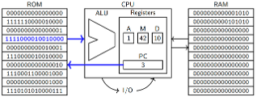
    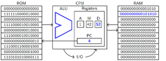

```asm
D 原来是 10，现在变成 10 + 42 = 52
A = 1，M = 42
PC 3 → 4
此时：D = RAM[0] + RAM[1] = 52
```
---
5. 步骤5：`A = 17`

    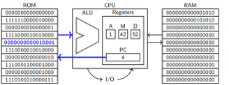
    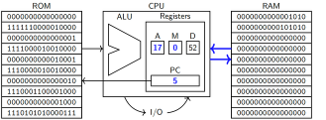
```asm
A = 17
M = RAM[17]（这里我们不在乎具体值）
PC 4 → 5
```
---
6. 步骤6：`D = D + A`

    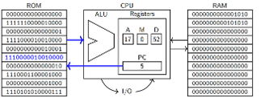
    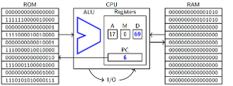

```asm
D 从 52 变为 52 + 17 = 69
A = 17
PC 5 → 6
```
现在：`D = RAM[0] + RAM[1] + 17 = 69`

---
7. 步骤7：`A = 2`
    
    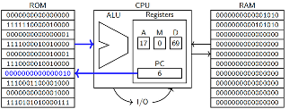
    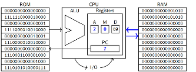

```asm
A = 2
M = RAM[2]（原值为 0）
PC 6 → 7
```
---
8. 步骤8：`M = D`

    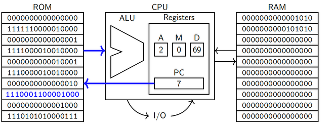
    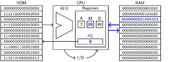

因为 M 是 RAM[A] 的别名，所以这条指令实际上是：`RAM[A] = D`，此时 `A = 2`，所以就是 `RAM[2] = 69`。

写完之后：
```asm
RAM[2] = 69
D 还是 69
PC 7 → 8
```
整个计算任务完成。

---
:::danger 重要程度：※※※※
一个非常重要的模式：
1. 想「读」RAM 某个地址：
2. 先 A = 地址 → 通过 M 读 RAM[A]。
3. 想「写」RAM 某个地址：
4. 先 A = 地址 → 把值写到 M，等价于写到 RAM[A]。
5. 程序最后：死循环
:::

    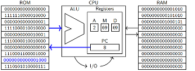
    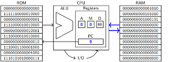
    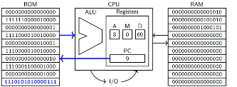
    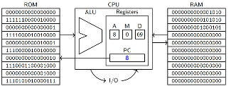
    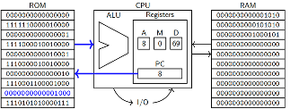
    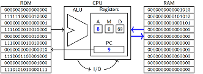
    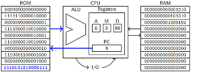
    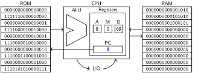

程序最后几条指令，做的是：
1. A = 8
2. PC = A（把 PC 的值设置为 8）这样一来，每次 CPU 执行到这里，都把 PC 重新设置成 8，于是又跑回第 8 号指令，再加载 8 到 A，再把 A 写进 PC，如此循环。
3. Hack CPU 没有「halt / stop」指令，所以：程序结束 ≈ 进入一个无限循环，一直在原地打转。
4. 这也是以后做循环、条件分支的基本思路：通过修改 PC，让程序跳到不同的地址上重复执行或选择性执行。

### 1.4 重点词汇
- CPU（Central Processing Unit）中央处理器：计算机的大脑，负责执行指令、做运算、控制整个系统。
- ROM（Read-Only Memory）只读存储器：存程序代码（指令）的地方，在 Hack 里程序写进去之后不再改变。
- RAM（Random Access Memory）随机访问存储器：存数据的地方，比如变量、数组、结果，读写都很快。
- Instruction 指令：CPU 每次执行的一小步命令，比如「把 0 存入 A」、「D = D + M」。
- Machine code 机器码：用 0/1 写出来的指令格式，CPU 直接读这个。
- Assembly language 汇编语言：用更容易记的符号（如 D=M）来写，之后再翻译成机器码。
- Fetch-execute cycle 取指-执行周期。每个时钟周期做的三件事：取指令（fetch）→ 执行（execute）→ 更新 PC。
- ALU（Arithmetic Logic Unit）算术逻辑单元：负责做加减、逻辑与或非等操作的硬件部分。
- Register 寄存器：CPU 内部的小型超快存储空间，比如 A、D、M、PC。
- Program Counter（PC）程序计数器：一个特殊寄存器，指向「下一条要执行的指令」的地址。
- Address 地址：内存中每个位置的编号，比如 RAM[0]、RAM[1]。
- Infinite loop 无限循环：程序永远在一小段指令之间来回跳，不再往下走。
- I/O（Input/Output）输入/输出：和外界交互的部分，比如键盘输入、屏幕显示。
- Operand 操作数：运算里参与计算的数字或变量，比如 A + D 里的 A 和 D。

### 1.5 拓展部分
1. Hack 的结构其实是典型的「哈佛结构」（Harvard architecture），程序（ROM）和数据（RAM）用的是两块独立的存储区域。现实中的通用 CPU 多数用的是「冯·诺依曼结构」，程序和数据都在同一个内存里。
2. ISA（Instruction Set Architecture 指令集架构）：「指令有哪些？每条指令的二进制格式是什么？它的语义是什么？」这些规则的总和就叫 ISA。我们现在正在学的 Hack 汇编 + 机器码，其实就是一个简单的 ISA。
3. 微架构 vs ISA 
    - ISA = 对程序员来说，「这台机器能做哪些指令」。
    - 微架构 = 对硬件工程师来说，「用门电路、寄存器、ALU 怎么实现这些指令」。
    - 同一种 ISA（比如 x86）可以有很多代不同的 CPU 实现（Intel, AMD 不同型号），这就是不同的微架构。
4. PC 控制流程（Control flow）通过修改 PC 的值，我们实现：
    - 顺序执行
    - 分支（if/else）
    - 循环（while/for）
    - 所有高级语言里的控制结构，最后在汇编层面都是「各种跳转 + PC 操作」。


## 2. Hack assembly I: The basics

### 2.1 背景：从 EDSAC 到汇编

1. 1940s–1950s 早期机器（比如 EDSAC）

    - 编程方式：最原始的是直接写机器码（0/1），或者用开关、插线板来“布线”。

很快大家就发现：直接写 0/1 实在太痛苦了。

2. 为什么要有汇编语言（assembly language）：直接写二进制机器码太痛苦，于是用“助记符 mnemonics”，一行文本对应一条机器指令，再由 assembler（汇编器） 翻译成机器码。
3. 打孔卡（punch cards）：很多人确实是把机器码/汇编写到打孔卡上。但理由不是“没有汇编”，而是：一个公司只有一两台超大的 mainframe，大量人排队用。让大家在机器房一人一会儿敲键盘太慢，不如把程序打在卡片上，管理员一次性把一大摞卡片“喂进”机器，效率更高。
4. Dumb terminal → 个人电脑（slide 上灰色老式终端机照片）。dumb terminal：自己没算力，只是键盘+屏幕，通过线连到 mainframe。再往后 CPU 越做越小，性能越强，就变成个人电脑 PC，每人一台。这个阶段之后，普通程序员日常直接用汇编器就现实多了。
:::danger 重要程度：※※※
汇编不是“很高级的语言”，而是对机器码的好记版本。一行汇编 = 一条机器指令，一一对应。汇编器只是“翻译器”，帮你把人类可读 → 机器可执行。
:::

### 2.2 A / M / D / PC（Hack 的寄存器）
Hack CPU 有 4 个关键寄存器，每个都是 16 位：
    
- `A`：address register（地址寄存器）
  - 特点 1：唯一可以“直接装数字”的寄存器（用 @number）。比如 @42 就是“把 42 装进 A”。
  - 特点 2：决定 M 指向哪一块 RAM。A = 100 ⇒ M 代表 RAM[100]。

- `M`：memory register（内存寄存器）
  - 读 M ⇒ 返回 `RAM[A]`
  - 写 M ⇒ 更新 `RAM[A]`
  - 可以把 M 理解成：“当前 A 指向的内存单元”，即，把 `A` 当指针，`M` 是 `*A`

- `D`：data register（数据寄存器）
  - 一个普通寄存器，没有“特殊副作用”。常用来 临时存储数据，做加减、与、或等运算。

- `PC`：program counter（程序计数器）
  - 总是 指向下一条要执行的 ROM 指令地址。下一条要执行的指令在 `ROM[PC]`
  - 默认每条指令之后 `PC = PC + 1`
  - 后面会学跳转指令，可以“间接地改 PC”，实现 `if`/`loop`

### 2.3 A指令和C指令（Hack 汇编的两大类指令）
1. A-instruction：`@number` 或 `@symbol`，举例：
    ```asm
    @0     // A=0
    @17    // A=17
    @R3    // A=3（R3 是关键字）
    ```
作用：把一个 16 位数字装进 A 寄存器。
- 如果写的是 纯数字：`@123` ⇒ `A = 123`。
- 如果写的是 关键字：`@R0`、`@SCREEN` 等，汇编器会替换成对应的数字。

除了 A 以外，D/M 不能用 `@number` 直接装任意数字，D、M 只能通过“算式”拿到常数（0、1、-1、加减 1 等）。

2. C-instruction：dest=comp;jump

- 一个 C 指令主要分两部分：
    - 右边 comp：要计算什么；
    - 左边 dest：把结果放到哪儿（可以是 1~3 个寄存器）；

- 常数操作（放常量）示例：
    ```asm
    M=0    // RAM[A] = 0
    D=1    // D = 1
    A=-1   // A = -1
    ```
    注意：这里只允许 0、1、-1，不能写 D=17。

- 一元操作（unary operations）：只对一个寄存器做事。“一元”意思是“一个操作数”，比如 -D、!D。
    ```asm
    D=A     // D = A
    A=-D    // A = -D
    D=!D    // D = NOT D（逐位取反）
    A=A+1   // A = A + 1
    M=M-1   // M = M - 1
    ```

- 二元操作（binary operations）：所有 二元运算 必须在 两个不同寄存器之间，并且 至少一个是 D。
    ```asm
    D=A+D   // D = A + D
    M=M-D   // M = M - D
    D=D&A   // D = D AND A
    A=D|M   // A = D OR M
    ```

- 不允许的例子：
    ```asm
    D=D+D × 两个操作数是同一个寄存器，不符合 Hack 的编码方式
    M=A+M × 没有 D 参与
    A=D+M+A × 三个操作数，根本没有对应机器码
    ```

- 拓展部分：这些限制不是“随便规定的”，而是因为 Hack 的机器码格式有限，ALU 输入只有两个端口，其中一个 固定接 D，另一个 在 A/M 之间选择。所以，任何二元运算都必须包含 D，且只有两个源操作数。

- symbolic variable / 符号变量：形如 @counter，由汇编器自动从 RAM[16] 起分配地址，并在整个程序中保持一致。

3. 多目标赋值：同时写多个寄存器
   
    有时你希望一个结果同时写到多个寄存器中：
    ```asm
    MD=D-M   // 计算 D-M，把结果同时写回 M 和 D
    AMD=D+1  // 结果写到 A、M、D 三个
    ```

:::danger 语法要求（有点烦，但要记）
左边最多可以出现 A、M、D 这三个。顺序必须是 A、M、D 的子序列（也就是：A 在 M 前，在 D 更前）：
```asm
MD=D-M √
AD=D+1 √
DAM=D+M ×（顺序不对）
```
这同样是为了让汇编器实现得简单、机器码编码更规则。
:::

### 2.4 注释、关键字、变量

注释（comments），汇编器会完全忽略：
- 以 `//` 开头的整行
- 行尾 `//` 后面的部分
- 空行 `&` 行首空格

例如：`D=M   // 把 RAM[A] 读到 D` ，对汇编器来说，第二行只相当于 `D=M`。

关键字(key words)：`R0–R15`、`SCREEN`、`KBD`、`SP`、`LCL`…
当你写：

```asm
@R0
@R1
@R15
@SCREEN
@KBD
@SP
@LCL
...
```

汇编器会偷偷把它们替换成对应数字：
```
R0–R15 → 0–15（常当“虚拟寄存器”用）
SCREEN → 16384（屏幕显存起始地址）
KBD → 24576（键盘输入地址）
SP、LCL、ARG、THIS、THAT → 0–4（以后做虚拟机 / OS 栈的时候用）
```
目的并不是让机器更强，而是，让你看代码更清楚。

变量（variables）

当你写一个从没见过的名字，比如：`@foo` ，汇编器会：
1. 第一次遇到 `foo`：
   - 给它分配一个 RAM 地址，比如 `16`
   - 然后把这一行当成 `@16` 来处理
2. 以后再看到 `@foo`，都统一当成 `@16`
    - 地址分配顺序：从 16 开始往上依次递增（因为 `0–15` 已经留给 `R0–R15` 了）
    - 区分大小写：`foo`、`Foo`、`FOO`被当成 3 个不同变量，对应 `16`、`17`、`18`。
    - 这让你可以写：
        ```asm
        @sum
        M=0      // sum = 0
        @i
        M=0      // i = 0
        ```
    而不用死记“sum 在 RAM[16]，i 在 RAM[17]”。
3. 但是一定要记住：
    - 这只是名字 → 地址的简单替换，背后没有“类型系统”、没有自动数组管理；
    - 如果你想自己手搓一段数组（比如 100 个元素），需要自己好好规划内存布局，不要和这些变量地址冲突，否则就会“互相踩内存”。

### 2.5 拓展部分
1. 不同 ISA 的汇编风格差异：`x86-64` 和 `ARM` 的汇编指令更复杂，寄存器更多，但“都是在控制寄存器+内存、指挥 PC 跳来跳去”；
2. ISA vs microarchitecture
    - ISA（Hack 汇编+机器码）定义的是：“这台虚拟机器能做什么”。
    - microarchitecture（你后面要搭的 Hack CPU）定义的是：“我们怎么用门电路实现这些功能”。
    - 同一个 ISA 可以有很多种硬件实现（就像 Java 可以跑在不同 JVM 上）。
3. 汇编优化 vs 算法优化
    - 先用好算法（比如用二分查找代替线性查找），再考虑手写汇编；
    - 对性能高要求的代码，先用 profiler 找出真正的热点。

---
## 3. 循环和条件 Loops and conditionals

### 3.1. `goto`：C 里的“任意跳”

首先是 C 语言里的 `goto`：

```asm
int main() {
    printf("Hello, World!\n");
    goto skip;
    printf("This will never run\n");
skip:
    return 0;
}
```
- `skip`: 是一个 label（标签，写成 名字: 这种形式，跳转的目标）
- `goto`：无条件跳转
- `goto skip;` ：不要继续下一行，而是跳到叫 skip 的位置继续执行。汇编里一般把这种跳转叫 `jump` / `branch` ，强调是单条机器指令干的事

所以上面程序只会打印 `Hello, World!`，不会执行中间那行。

### 3.2 `if` / `while` 和 `goto` 的转换

现实中的 C 语言虽然有 `while` / `if` ，但这些都可以用 goto + 一行 if 实现；汇编层面一般只有 goto 风格的跳转。把 while / if-else 全部改写成 goto 版本：

例子 1： `while` 循环

原版（正常 C）：
```asm
int i = 0; while(i < 10) {
printf("%d\n", i);
i++;
}
```

可以改写成：
```asm
int i = 0;
loop:
    if(i >= 10) goto endLoop;
    printf("%d\n", i);
    i++;
    goto loop;
endLoop:
    return 0;
```
- 循环开头有一个 label：`loop:`
- 一开始就用 `if (condition broken) goto endLoop;`
  - 这里 condition = `i < 10`
  - broken 后就是 `i >= 10`
- 循环体末尾 `goto loop;` 回去再来一轮
- 循环结束位置有个 `endLoop:` 标签

例子 2： `if` / `else-if` / `else`

原版：
```asm
if (argc == 1) {
    // code block 1
} else if (argc == 2) {
    // code block 2
} else {
    // code block 3
}
```

可以改写为一堆 one-line `if + goto`：
```asm
if (argc == 1)
    goto one;
if (argc == 2)
    goto two;
goto three;

one:
    // code block 1
    goto end;
two:
    // code block 2
    goto end;
three:
    // code block 3
end:
    return 0;
```
逻辑一样，但写法更“原始”。

小结：所有 结构化控制流（ `if` / `while` / `do-while` / `switch` ）都可以用 `goto` 模拟出来。这就是为什么编译器在把高级语言翻译成汇编时，会大量生成「跳转指令」。

### 3.3 结构化编程 & 意大利面条代码

1. 意大利面条代码spaghetti code：这种乱七八糟、满地 goto 、控制流绕来绕去像一碗面条的代码。
2. 结构化编程structured programming：
    - 结构化写法（if / while / function call）有固定形状：
    - 看见一个 while (...) { ... }，你大概能一眼知道控制流会怎样走：先检查条件 → 再执行括号里的内容 → 再回到条件；
3. 结构化编程（structured programming） 的核心思想：
    - 尽量只用顺序执行； `if` / `else` / `while` / `for` 函数调用；
    - 少用或不用 `goto`
4. 拓展部分
    - 结构化编程是软件工程史上的一个大转折点。
    - 但在编译器生成的汇编里，底层依然全是 goto（跳转指令），只是编译器帮我们做了这件脏活。
    - “Wait, it’s all GOTOs? — Always has been.” 就是在说：底层其实一直都是跳转。

### 3.4 用 `jump` 实现 `goto` 和条件跳转

1. Hack 的跳转语法
    任何不是 `@` 开头的指令（也就是 C 指令），都可以在后面加上 `;Jxx` ，即 `dest = comp ; Jxx`。表示“如果本条指令的计算结果满足条件，就跳到 A 中存的 ROM 地址”，例如：`M=A+D;JGT`。
    表示先做 `M = A+D`，看刚刚算出来的结果（就是 `A+D`），如果 `A+D>0`，就跳到 `ROM[A]`；否则不跳，继续执行下一条指令。
    你也可以不要左边 dest，只用来判断 + 跳转：`A+D;JGT   // 只算 A+D，根据结果决定跳不跳，不把结果存到寄存器里`

2. Jump 条件表
    Mnemonic	含义		        是否需要条件
    `JMP`	    always jump	        无条件
    `JGT`	    greater than	    结果 > 0
    `JEQ`	    equal		        结果 = 0
    `JLT`	    less than	        结果 < 0
    `JGE`	    greater or equal	结果 ≥ 0
    `JLE`	    less or equal	    结果 ≤ 0
    `JNE`	    not equal	        结果 ≠ 0

- 跳转条件永远是 “刚刚那个表达式的结果”和 0 比较；
- `G` = greater, `L` = less, `E` = equal，组合起来就是各种关系；
- 所有跳转都是去 A 里存的地址。所以在写 `...;Jxx` 之前，要确保：用 `@something` 或计算，目标地址已经被写进 A。

3. 重要陷阱：PC 与 A 在下一个时钟边沿同时更新，所以 `A=A+D;JMP` 行为未定义undefined behavior。
    - 原因：不能在一条指令里既改 A，又要按 A 来决定跳到哪；规格里没有严格规定：在下一周期开始的时候，PC 用的是「旧的 A」还是「新的 A」；不同实现的 Hack CPU 可能会做出不同的行为。
    - 简单说：这么写可能在不同模拟器 / 硬件上跑出不一样的结果，所以禁止这么干。
    - 安全写法：先单独一条指令更新 A：A=A+D；再下一条指令 0;JMP 使用更新后的 A 来跳转。

### 3.5 Label（标签）存在的原因

想象你不用标签，只用数字跳转：
第 100 行（去掉空行和注释后数）是你想跳过去的位置，它存放在 ROM[99]。你就得写：

```asm
@99
0;JMP
```

问题：如果你在前面插入 / 删除了一行汇编：所有后面的行号都变了，所有 @xx 的数字都得重新算一遍，逐个改，非常痛苦
1. Hack 的标签语法
    解决办法：assembler 提供了标签 label。
    语法：(LOOP) 这一行 不生成机器码，只被 assembler 记下来。
    它的意思是：“下一条真正会被翻译成机器码的指令，将放在 ROM 的某个地址（比如 23），请你把所有 @LOOP 都当成 @23 来翻译”。因此：

    ```asm
    (LOOP)
        // some code...
        @LOOP
        0;JMP
    ```

    在汇编之后，等价于（假设 LOOP 对应 ROM[10]）：

    ```asm
        // some code...
        @10
        0;JMP
    ```

2. 在中间插入 / 删除几行代码，不需要改每个跳转的数字，assembler 在翻译时自动重新计算每个 label 对应的地址。

### 3.6 图灵机

1. 理论模型：Turing machine（图灵机）。大致长这样：
- 一条向左和向右无限延伸的 纸带（tape），被分成很多格子，每个格子是 0 或 1。
- 一个 读写头（tape head），每一步：
  - 读取当前格子的值（0 或 1）；
  - 根据「现在的状态 + 当前读到的值」：
    - 决定写 0 还是写 1；
    - 决定向左移动一格还是向右移动一格；
    - 决定切换到哪一个新状态，或者停止（halt）
  - 有一个有限个状态的集合（state 1, state 2, …）

2. 演示：

    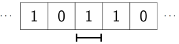
    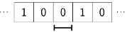
    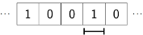
    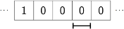
    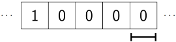
    
    Machine in state 3, head reads 1    → Write 0, move right, enter state 3.


    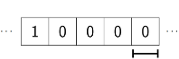
    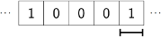
    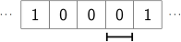
    
    Machine in state 3, head reads 0 	→ Write 1, move left, enter state 7.

    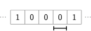
    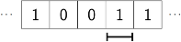
    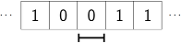

    Machine in state 7, head reads 0 	→ Write 1, move left, enter state 1.

    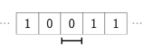
    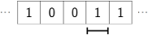

    Machine in state 1, head reads 0 	→ Write 0, move right, enter state 10.

    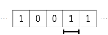

    Machine in state 10, head reads 1 	→ Halt.
    
    最后进入某个终止状态 10 看到 1 	→ 停止，老师也强调了：正式定义那部分不考，不用背细节。

3. 图灵完备Turing-complete

    如果一个计算问题是“可计算的”，就存在某个图灵机能解决它。—— 这就是 Church–Turing thesis（丘奇–图灵论题）。
    
    因此：如果某种计算模型（比如某种汇编语言、某个编程语言、某个抽象机器）可以模拟任何图灵机，我们说它是 Turing-complete 图灵完备。
    
    换句话说：只要你有足够内存 + 时间，它就「理论上」能做所有可计算的事。

4. 对 Hack 的意义：
    - 加上可以无限大扩展的内存（理论上的）；条件跳转 + 循环（也就是你这章学的 jumps + labels）；
    - Hack 就能模拟任意图灵机 → 它就是一个「真正的通用计算机」。
    - CPU 的指令集 + 内存模型，决定了这台机器是否图灵完备，像今天这种有算术、读写内存、条件跳转的模型，一般都能做到图灵完备。

## 4. 输入输出 Input and output

### 4.1 内存映射 memory-mapped I/O

在 Hack 里：
- 唯一 输入设备：键盘（keyboard）
- 唯一 输出设备：显示器（monitor）

1. 所有 I/O 都是 memory-mapped（内存映射）：外设（键盘、屏幕）被映射到特定内存地址范围，CPU 通过普通 load/store 指令就能访问设备。
2. CPU “看键盘、画屏幕” 的方式，和“读写 RAM” 几乎一模一样：
    - 想读键盘：从一个特殊地址读内存
    - 想画屏幕：往一片特殊地址写内存
所以从汇编程序员的角度看：
    - 写 M=... 到某个地址 —— 有时是普通 RAM，有时就是在画屏幕
    - 读 M 从某个地址 —— 有时是普通变量，有时其实是在读键盘状态
3. 地址布局（16-bit word 地址）
    - RAM：Hack有32KB物理内存，按 16位一格来算，地址范围：0x0000 到 0x3FFF (十进制 0 到 16383)；
    - 屏幕（SCREEN）：0x4000 到 0x5FFF（显存，像素映射）；指向屏幕 buffer 起始 word。
    - 键盘（KBD）：0x6000 当前按下的某个键的编码会出现在这里，即键盘寄存器；M 里是当前按键编码，0 表示无按键。

### 4.2 键盘输入：@KBD 就是“读当前按键值”

`@KBD` → A = 24576 (= 0x6000)；`M` 里是当前按下键的编码（例如 'd' → 100），若没按键则为 0。
下面这张小表：展示了很多字符对应的数值，例如 `空格`=32，`d`=100 等（ASCII 编码）。

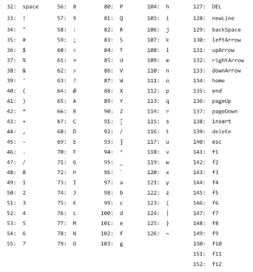

规则：关键字 `KBD` 映射到地址 `0x6000`（十进制 24576）。当你写：

```asm
@KBD   // A = 24576
D=M    // D = RAM[24576]
```

- 如果 没有按任何键：`RAM[24576] = 0`
- 如果正按着一个键，比如 `d`：`RAM[24576] = 100`（十进制）

也就是说：
- 想知道“有没有按键”：看 RAM[KBD] 是不是 0。
- 想知道“按的是哪个键”：看 RAM[KBD] 的数值是多少。

注意：Hack 不能检测「同时按了多个键」——现实中很多键盘也会“鬼键冲突”，某些组合按着不一定能都检测到。

### 4.3 屏幕输出：512×256 像素是怎么塞进内存的？

Hack 屏幕分辨率：512列×256行 像素。所以一共 512 × 256 = 131072 个像素。但屏幕内存只有从 0x4000 到 0x5FFF，一共 8192 个 16 位字。8192 × 16 = 131072，刚好一一对应。
1. 像素顺序：按“书本顺序”：像素是从左到右、从上到下排列编号的，就像你读一本书那样：

    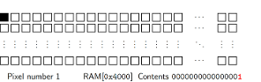
    
    第一行：从左数第一个像素 = 像素 1
    
    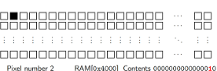
    
    第一行：从左数第二个像素 = 像素 2
    
    …
    
    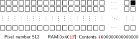

    第一行最后一个像素 = 像素 512
    
    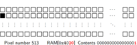

    第二行第一个 = 像素 513
    
    …
    
    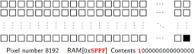

    最后一行最后一个 = 像素 512×256 = 8192

2. 每 16 个像素对应一个内存单元
    - 显存里，从 0x4000 开始，每个 16-bit word 控制 16 pixel像素：地址 0x4000 的 16 个 bit（计算机里面数bit的传统 bit15 ........ bit2 bit1 bit0 从右往左数）控制：
    ```
    bit0 → 像素 1
    bit1 → 像素 2
    …
    bit15 → 像素 16
    ```
    地址 0x4001 控制像素 17–32，以此类推。

    - 像素颜色：对于第 i 个像素，如果它：对应 bit 是 1 → 黑色；对应 bit 是 0 → 白色
    - 想把最左上角 16 个像素 全部刷成黑色：只需要写：RAM[0x4000] = 0xFFFF（二进制全 1）；想全部刷白：写：RAM[0x4000] = 0x0000（全 0）。

3. 用行列 (r, c) 到地址的换算
    - 一个像素位于：行号 r（从上往下从 0 开始）列号 c（从左往右从 0 开始）
    - word地址 = `0x4000 + 32*r + (c / 16)`（整数除法）
    - 在该 word 中的 bit 位置： (c % 16)（对16取模）
    - 直观理解：一行有 512 个像素，每 16 pixels对应1 word ⇒ 每行有 512 / 16 = 32 个 word，所以 32*r 就是“前面 r 行占了多少个 word”。这一行的“起始 word 地址偏移量” = 32*r，再加上本行中“这是第几个 16 像素块” → (c / 16)；本行内的 word 索引 = c / 16（只取整数部分）；行内的“块内第几个像素” → c % 16

### 4.4 Tricks and traps

1. `@number` 命令只能处理 15-bit 非负数
   - 15-bit 最大是 0x7FFF = 32767，想要 0xFFFF = 65535，不能直接写：@65535   // × 得到的不是 0xFFFF，正确做法（两种典型写法）：
   - 利用取反：
    ```
    @0
    A=!A    // 0 逐位取反 → 0xFFFF
    ```
    - 直接用： `A=-1    // 在 Hack 里 -1 的二进制就是 0xFFFF`

2. `SCREEN` 关键字 + 读屏幕
    - `SCREEN` 映射到 `0x4000`：方便写图形程序
    ```asm
    @SCREEN
    M=1   // 把最左上角的那个像素刷成黑色（低位 bit=1，其余 0）
    ```

3. 不只是能写，也能读：
    ```asm
    @SCREEN
    D=M   // 把最左上角那 16 像素对应的 word 读到 D
    ```
    如果那 16 个像素全黑，则 `D = 0xFFFF`。

### 4.5 例子：`fill.asm` 逐行拆解

目标（文件开头的注释已经写得很清楚）：
- 当没有按键时：把整个屏幕所有像素刷成黑色
- 当按着任意键时：把整个屏幕所有像素刷成白色
- 一直循环检测，实时刷新

1. 伪代码回顾。文件里已经给了伪代码：
    ```asm
    While True:
        For every i between 0x4000 and 0x5fff:
            If RAM[KBD] != 0:
                Write 0x0000 to RAM[i].
            Otherwise:
                Write 0xFFFF to RAM[i].
    ```

    翻译：永远循环；每次循环里，从 i = 0x4000（第一个屏幕 word）到 0x5FFF（最后一个屏幕 word）逐个遍历：每一个 i：如果键盘值不为 0 → 说明有键在按 → 把这块屏幕内存设成 0x0000（白），否则 → 没有键按 → 设成 0xFFFF（黑）

2. 大循环 bigloop：负责“从头再刷一遍屏幕”
    ```asm
    (bigloop)
        // For all i between 0x4000 and 0x5fff:
        @SCREEN
        D=A
        @i
        M=D
    ```
    
    解释：
    - `(bigloop)`：定义一个 label，表示“整个外层循环的开始”。
    - `@SCREEN` → A = 0x4000
    - `D=A` → D = 0x4000
    - `@i` / `M=D`：
      - `i` 是一个变量名（被汇编器分配到某个 RAM 地址，比如 16），
      - `M=D` 就是把 `0x4000` 写到 `i` 对应的内存里：`i = 0x4000`。

    也就是：每次从 bigloop 重新开始时，都把 i 重置为屏幕起始地址。

3. 小循环 smallloop：负责“遍历屏幕上的每一个 word”
    ```asm
    (smallloop)
        // If i = 0x6000: Jump to bigloop
        @i
        D=M
        @KBD
        D=D-A
        @bigloop
        D;JEQ
    ```
    这一段是在做“循环结束条件检测”：
    接下来：
    ```asm
        // If RAM[KBD] != 0, jump to (writezeroes)
        @KBD
        D=M
        @writezeroes
        D;JNE
    ```
    逻辑：读键盘当前值到 D，如果 D ≠ 0，说明有键按下：D;JNE 跳到(writezeroes)，也就是“写 0x0000（白色）”那段；否则 D == 0，没有键按：就继续往下执行 “写 0xFFFF（黑色）” 的代码。

4. 没有按键：写 0xFFFF（黑）

    ```asm
        // Otherwise, write 0xFFFF to RAM[i]
        D=0
        D=!D
        @i
        A=M
        M=D
        @i
        M=M+1
        @smallloop
        0;JMP
    ```

5. 有按键：写 0x0000（白）

    ```asm
        // Write 0x0000 to RAM[i]
        (writezeroes)
        D=0
        @i
        A=M
        M=D
        @i
        M=M+1
        @smallloop
        0;JMP
    ```

6. 程序最后的无限循环
    
    文件尾部：
    ```asm
        // Loop
        @bigloop
        0;JMP
    ```
    虽然在逻辑上 bigloop 本身就是一个无限循环，但这句让程序在完成某次“扫屏”后，保证总能回到 bigloop 开始处重复。

7. 程序结构
   - bigloop：外层死循环，每次从头扫一遍屏幕。
   - i：指针变量，从 SCREEN 起始地址一路加到 KBD，表示“当前要刷哪块屏幕内存”。
   - smallloop：内层循环，每次处理一个屏幕 word：
     - 如果键盘值=0：写 0xFFFF（黑）
     - 如果键盘值≠0：写 0（白）
   - 这样就实现了：按任意键 → 全白；松开 → 全黑。