# 07. The Hack ISA

Hack ISA：一条汇编指令如何变成 16-bit 机器码（位域怎么拆）。

Hack microarchitecture：CPU/ROM/RAM/PC/ALU 这些模块如何连线来执行 ISA。

Comparative architecture：遇到新 ISA 该看哪些维度（Harvard/vN, RISC/CISC, addressing modes, interrupts）。

Optimisation：流水线提高吞吐、hazard 造成 stall；缓存层级解释“内存为什么慢、cache miss 为什么贵”。

## 7.1. The Hack ISA

**Instruction Set Architecture (ISA)** / 指令集架构：机器对机器码的“行为规范”。ISA 是软件和硬件的“契约”。软件（编译器）必须遵守 ISA 才能写出 CPU 能执行的二进制。

**Microarchitecture** / 微架构：硬件如何实现这些行为（电路、时序）。CPU（microarchitecture）必须实现 ISA 规定的行为。

**A-Instruction**：我要访问这个地址

```text
0 v15 v14 ... v1 v0   ← 共 16 bit，第一位必须是 0
```
作用：把数值放进寄存器 A（A 可以是地址，也可以是数据），例如：`@21` 的机器码是： `0000000000010101`

**C-instruction**：我要做计算/跳转

```text
111 a c1 c2 c3 c4 c5 c6 d1 d2 d3 j1 j2 j3
```
作用：做一次计算（comp），把结果送到寄存器（dest），再根据条件跳转（jump）

### 7.1.1 A-instruction
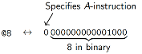

格式：`0 v15 ... v0` 第一位必须是 0，后面 15 位是数值。

这个值会进入 A 寄存器：`A = value`
- 如果 `value < 16384（0x4000）` → 普通 RAM 地址
- 如果 `value ≥ 16384` → 特殊 I/O（如屏幕、键盘）

**Opcode** / 操作码：标识指令类型。A 指令 opcode=0。

**Operand** / 操作数：A 指令只有一个 15-bit operand。行为：把 operand 复制到 A（并影响 M=RAM[A]）。

常见用途：
1. **指向某个内存地址**（后面用 M 访问）；
2. 做 **常量计算** （C 指令用 A 寄存器里的值）；
3. **跳转到某个ROM地址** （`0;JMP`）。

`@` 不能装16-bit的常量的原因：
An A-instruction cannot load a 16-bit constant because there are not enough bits in the instruction format to represent a 16-bit value.

### 7.1.2 C-instruction

目的：让 CPU 的硬件实现足够简单。

每条 C 指令分 3 部分：`dest = comp ; jump`

`comp` （必须）：告诉 ALU 要做什么计算。例如：
```
D+A
D-M
0
-1
!D
A
M
```
`comp` 字段完全决定 ALU 控制线

`dest` （可选）：告诉 CPU 把计算结果写到哪里：
```
null（表示不写）
A
D
M
AD
AM
MD
AMD
```
`dest` 字段对应写入 enable 线

`jump` （可选）：跳不跳？
```
null（不跳）
JGT
JEQ
JGE
JLT
JNE
JLE
JMP
```
`jump` 字段对应 PC 控制器（jump logic）

ISA 直接贴合电路结构 → 你在 HDL 里实现 CPU 时就会看到这些信号一一对应。

### 7.1.3 C 指令的二进制格式*

C 指令机器码整体结构（必须记熟）

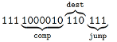

```text
111 a c1c2c3c4c5c6 d1d2d3 j1j2j3
```


|字段|位数|作用|
|----|----|----|
|`111`|3 bit|标记这是 C 指令
|`a`|1 bit|ALU 使用 A 还是 M
|`c1–c6`|6 bit|ALU 的具体计算方式（comp）
|`d1–d3`|3 bit|把结果写到哪里（dest）
|`j1–j3`|3 bit|跳转条件（jump）

:::danger 重点
C 指令机器码整体结构必须记熟
:::

**a-bit**：使用 `A` 还是使用 `M` ？

```text
111 a cccccc ddd jjj
```

这是整个 C 指令里最重要、最容易搞混的一位。
- `a = 0` → ALU 里用 A（comp 字段里的 A 是 A 寄存器）
- `a = 1` → ALU 里用 M（comp 字段里的 A 是 RAM[A] = M）

例子：
- `D = A + 1`：因为用 A，不是 M → `a = 0`
- `D = M – 1`：因为用 M → `a = 1`
---
**`comp` 字段（6-bit）**

作用：告诉 ALU 你想进行什么计算。

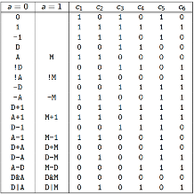

格式：`a c1 c2 c3 c4 c5 c6`（a 位单独放，但一起理解为 comp 字段）

如果是 `M：D+M = (a=1, c1..c6 same as D+A)`

---
**`dest` 字段（3-bit）**

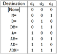

---
**`jump` 字段（3-bit）**

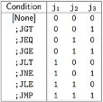

jump 的逻辑：让 `PC = A` 的值跳到 A 指向的 ROM 地址。跳不跳完全取决于 ALU 的输出 是否满足 jump 条件。

:::warning 练习：把汇编翻译成机器码
构造一个例子：D = A + 1
comp = A+1 → a=0, c1–c6=110111
dest = D → 010
jump = null → 000
组合：111 0 0110111 010 000
最终机器码：1110011011101000
:::

### 7.1.4 Jump Logic 跳转逻辑

在 Hack ISA 中，每一条 C 指令：`dest = comp; jump`

`comp` 的结果会经过 ALU， `jump` 必须根据 ALU 输出的 **符号（负/零/正）** 决定。

The ALU 表明确显示：

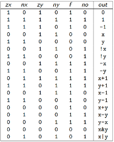

ALU 会输出一个值 out，然后你必须检测 out 是 `zero` / `positive` / `negative` （用于跳转）

ALU 决定要不要跳，跳不跳取决于 ALU 的输出：
- `zr` → ALU 输出是否为 0
- `ng` → ALU 输出是否为负
- `pos` （隐含）→ 如果不是 `zr` 也不是 `ng` ，就是正

例如：
```text
D;JGT → 如果 D>0 ，就跳
D;JEQ → 如果 D==0，就跳
D;JLT → 如果 D<0 ，就跳
```
跳不跳由 ALU / comp 结果控制，和 A 无关。

然后 jump 字段来决定怎么跳：
|`Jump`|意义|
|---|---|
|`JGT`|output > 0|
|`JEQ`|output == 0|
|`JGE`|output >= 0|
|`JLT`|output < 0|
|`JNE`|output != 0|
|`JLE`|output <= 0|
|`JMP`|无条件跳转|

CPU 跳转时真正做的事情是：
```text
如果 jump 条件“满足”    → PC = A
如果 jump 条件“不满足”  → PC = PC + 1
```
所以跳转一定会去 A 寄存器指向的 ROM 行号：
**不能跳到 `RAM` ，不可能跳到 `M` ；只能跳到 `ROM` （程序指令所在的区域）**，这点对于写 Hack 程序时至关重要。

:::warning 为什么 `jump` 必须依赖 ALU？
因为这是 **减法判断跳转** 的经典模式：

例如 `D;JGT   // 如果 D > 0 就跳`：在大多数 CPU（MIPS、ARM、RISC-V）中都是：跳转 = 根据比较运算的结果
:::

:::warning 为什么跳转目标必须是 `ROM` 地址？
因为：
- `PC` 决定 下一条执行的指令地址，而指令存在 `ROM` （Instruction Memory）；
- `RAM` 只存数据，不可能执行。

因此：跳转目标必须是 `ROM` 中的某个行号，且跳转目标只能放在 `A` ， `A` 必须代表一个 `ROM` 地址。
:::

## 7.2. Hack microarchitecture

### 7.2.1 `ROM`/`RAM`的接口行为

**ROM（只读，用来存程序）**

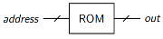

- 大小：64KB（Hack 真实机为 32K，但 Logisim 用 64K）
- 地址空间：15 bit
- 字节：16-bit words
- out = `ROM[address] unclocked` 是 无时钟（unclocked）→ 地址变，输出立即变


**RAM（读写，用于存数据）**

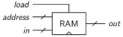

- 大小：64KB（教学版扩展）
- 地址空间：15 bit
- 字节：16-bit words
- out = `RAM[address] unclocked` 也是无时钟 → 但是，写入在 clock tick 且 `load=1` 时发生。读：无时钟（即时）

这直接影响你实现 CPU 时：
```text
inM = RAM[A]
outM = ALU 输出
writeM=1 时写回 RAM[A]
```

### 7.2.2 `CPU`的外部行为

每个周期 CPU 输出：

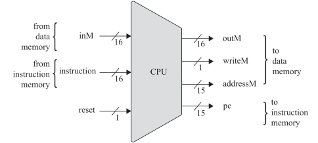

|信号|含义|
|---|---|
|`pc`	|当前执行的指令地址（给 `ROM` ）instruction memory 指令存储器
|`addressM`|我要访问 `RAM` 的地址（`=A`）
|`inM`|`RAM[addressM]` 的值（ `RAM` 输出）
|`outM`|写入 `RAM` 的值（如果 `writeM=1`）
|`writeM`|是否写入 `RAM`
|`reset`|复位 `PC`

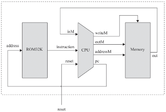

`pc` 输出去 `ROM` `地址；instruction` 从 `ROM` 进 `CPU` ； `inM` 是 `RAM[A]` 读到的值。


`addressM` = A； `outM` / `writeM` 控制写 `RAM` 。


### 7.2.3 PC 程序计数器的优先级与约束

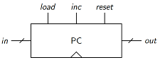

`in` 是16-bit的输入， `out` 是16-bit的输出；`lode`，`inc`，`reset` 同一周期只会有一个是1；

程序计数器 PC 在每个时钟周期clock cycle：
- 起始，如果 `reset = 1`    → `PC = 0`	→清零
- 否则，如果 `load = 1`     → `PC = in`	→装载 `in` ，这是跳转 `Jxx` 实际生效的唯一方式
- 否则，如果 `inc = 1`      → `PC = PC+1`	→自增
- 最终，如果 `三个都不是 1`   → `保持不变`

:::danger 注意
任何跳转是PC.load = 1（PC ← A）
不跳转则是PC.inc = 1（PC ← PC + 1）
:::

所以 `D;JGT`：跳转目标 = A 寄存器的地址
- 如果跳转：`PC ← A    // load=1`
- 如果不跳：`PC ← PC+1 // inc =1`

### 7.2.4 ALU 与 comp 的对应关系

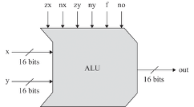

**ALU 是 unclocked，由控制位决定 out**。

ALU 接受：
- `x = D`
- `y = A` 或 `M`
- 控制信号 = `c1..c6`

Out = `positive`, `negative`, or `zero`

这个 ALU 表完全对应你在 Week 7 Part 1 学的 `comp` 字段。
:::danger 注意
ALU 控制位对应 C 指令 `comp` 的 `c1..c6`（也就是要能把 ISA 的 comp 字段“接”到 ALU 控制线上）。
:::

### 7.2.5 CPU 总体结构

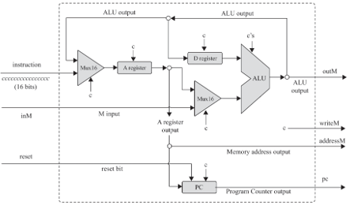

这是最重要的一张图。
1. 指令进入 → 拆成：
    ```
    A/M 选择
    comp 控制位
    dest 控制
    jump 控制
    ```
2. ALU 做计算
3. 结果送回：
    ```
    D
    A
    RAM（M）
    ```
4. `jump` 逻辑决定：
    ```
    load PC（跳转）
    inc PC（顺序执行）
    ```

## 7.3. Comparative architecture 比较结构

### 7.3.1 ISA基本属性

- 字长（word size）：A “64-bit” CPU means a 64-bit word size
- 地址空间（address space）
- 指令长度（instruction length）：通常是字长的倍数，可以是可变的
- 设计哲学：Harvard vs von Neumann；RISC vs CISC
- 寄存器（register types）
- 寻址方式（addressing modes）
- 硬件中断（hardware interrupts）

### 7.3.2 Harvard vs von Neumann

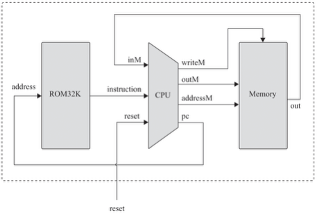

这是计算机体系结构中最基础、最重要的概念之一。

1. **Hack** ：指令 `ROM` + 数据 `RAM` → Harvard architecture；
2. 电脑的 CPU（x86/ARM）指令和数据同 RAM是 **von Neumann**（也叫“普林斯顿架构”）

**Harvard 架构**

Hack CPU 有两个不同的存储器接口：
1. ROM32K → 指令（instruction memory）
2. RAM16K → 数据（data memory）

**Harvard 架构的核心优势**：Instruction memory（指令存储器 ROM） 和 data memory（数据存储器RAM）完全分离，独立的存储单元、地址线与数据通道。所以，CPU 每个周期可以 **同时取指**+**访问数据**：

|ROM（指令存储器）|RAM（数据存储器）|
|---|---|
|读下一条指令|读/写数据|
|PC → ROM 地址|A → RAM 地址|

:::info 这就是为什么 Hack CPU 很适合教学
·简单
·数据通路清晰
·不会产生“指令和数据抢同一条总线”的冲突
:::

**von Neumann 架构**（现代 CPU 使用的）
- 程序和数据全部都在 一个统一的 RAM 里：CPU 每次访问内存，不管是指令还是数据，都必须通过同一条总线（memory bus）；
- 结果：指令与数据共享一个通道，会出现“瓶颈”，这称为：Von Neumann bottleneck（冯诺依曼瓶颈）；
- 例如：CPU 正在读取下一条指令，同时想访问数组里的一个元素？不行！必须排队！
- 为了加速，现代 CPU 使用 cache 技术：
    ```
    I-Cache（指令缓存）
    D-Cache（数据缓存）
    ```
- 这会形成所谓的：修改后的 Harvard 结构（Modern Harvard Architecture）。因此你在 ARM/x86 中看到：
L1 cache 分成 I-cache 和 D-cache（像 Harvard），但更底层仍然共享同一块 RAM（像 von Neumann）。

### 7.3.3 RISC vs CISC*

|RISC|CISC|
|---|---|
|简单指令，多条组合完成任务|复杂指令，单条指令就能做很多事|
|Reduced Instruction Set Computer|Complex Instruction Set Computer|
|每条指令非常简单|指令可以非常复杂|
|指令长度一致（fixed-length）|可变长度（1 byte → 15 bytes）|
|执行速度快1 cycle|通常一条指令要any number of cycles|
|硬件结构简单|硬件内部复杂|
|需要更多条指令才能完成复杂任务|单条指令可以做很多事情|

:::warning Hack = 极简 RISC 风格
原因：指令格式只有两种（A 和 C）；位宽固定（16 bit）；指令数量极少；没有复杂寻址模式；没有“加载并加法”这种 CISC 指令；控制逻辑特别简单；

事实上 Hack 是“比 RISC 还 RISC”，是教学级的 ultra-RISC。但是注意：Hack 并不完全是“真正的” RISC，因为真正的 RISC 通常有几十个通用寄存器、流水线、branch delay slot 等。Hack 只是用来教学 CPU 本质。
:::

### 7.3.4 Addressing Modes

Addressing mode = CPU 如何根据一条指令，找到它想访问的数据。

所有现代 CPU 都提供多种 addressing mode：
- 立即数（Immediate）
- 直接寻址（Direct）
- 寄存器寻址（Register）
- 间接寻址（Indirect）
- 带偏移的间接寻址（Indexed / Base + Offset）
- 更多复杂模式（仅 CISC 有）

Hack ISA 的 addressing mode 非常少，因此是 RISC 风格的极端版本。

**Immediate Addressing（立即数寻址）：数据来自指令本身。**
- Hack 中最典型的例子：`@511`；意思是：把 511 这个 字面上的值放进 `A` 寄存器。不是从某个地址读，也不是引用变量，就是直接把常量放进去。
- ARM 也有：`MOV R0, #511`
- MIPS：`ADDI R0, R0, 511   // 只能模拟立即数，MIPS 没有 MOV #imm`
- Immediate addressing 的核心特征：**数据直接来自指令本身（字面量）**。

**Direct Addressing（直接寻址）：访问一个固定位置或寄存器**

Hack 中的例子：`D = A + D`；这里访问的是寄存器本身的值：“A”和“D”这两个名字就是实际数据位置。
如果写：
```text
@label
D = A
```
那是“label 的地址”直接出现在 A 寄存器中，因此叫 direct addressing。

ARM 的直接寻址：`LDR R0, =value   // 把常量地址/值直接加载进寄存器`

**Indirect Addressing（间接寻址）：从寄存器中取地址，再访问该地址的内容**

Hack 中的经典例子：
```text
@i 	    // 设置 A = i 的地址
A = M	// 把 RAM[i] 的值 作为一个新的地址 放进 A
```
因此，你得到的是一个“指针”。

再之后你访问 M 时：`M = D + 1`，访问的是：`RAM[ RAM[i] ]`，也就是 间接寻址（pointer dereference）
这是 Hack 中处理数组、指针的唯一方式。

ARM 示例：`LDR R0, [R1]   // R1 里面存的是地址`

MIPS：`LW R0, 0(R1)`

**Indexed Addressing（带偏移的间接寻址）：从“基址+偏移量”访问内存**

ARM 一条指令就能做到：`LDR R0, [R1, #0xBEEF] // 从地址 R1 + 0xBEEF 的位置取数据`

这是 C 语言数组 array[index] 的硬件实现基础。

MIPS 也有：`LW R0, offset(R1)`，意味着：`R0 = RAM[R1 + offset]`，而 Hack 没有这一功能，必须用三条或更多指令拆开：
```text
@offset
D = A@base
A = M
A = A + D
D = M
```
这就是 Hack 属于 RISC（极简）架构的一个理由。

### 7.3.5 Hardware Interrupts

**Hack 计算机没有中断 → 必须 Input Polling（轮询，不停读 KBD），缺点：浪费周期、可能漏输入**。Hack 只能写：
```text
(loop)
read keyboard
if pressed do sth
goto loop
```
也就是说：Hack CPU 必须手动不断检查键盘，不能由键盘主动“呼叫” CPU，这叫 **Polling（轮询）**。

现代 CPU 有一个 **中断引脚（INT pin）**，外设（例如键盘）可以发送一个电信号到 CPU：

```text
[Keyboard] --INT signal--> [CPU]
```

CPU 收到信号以后：立即 **暂停当前指令流（保存现场）**→ 转到一个 **固定位置（interrupt vector）**执行处理程序 → 处理完后返回继续执行原程序

**Interrupt Vector（中断向量）**

CPU 需要知道：
- 键盘事件 → 跳到哪里执行？
- 定时器中断 → 跳到哪里？
- 内存保护错误（segfault）→ 跳到哪里？

这叫 **中断向量表（Interrupt Vector Table）**。
你可以理解为：
```
中断 0 → 地址 0x100（处理键盘）
中断 1 → 地址 0x120（处理鼠标）
中断 2 → 地址 0x140（处理磁盘）
...
```
这就是 OS 如何处理不同的系统级事件。

**Interrupt vs Exception**

- Interrupt（外部事件）由外设触发：键盘、鼠标、网络卡、磁盘、定时器（实现多线程）
- Exception（内部错误）来自程序内部：divide by zero; segmentation fault; illegal instruction; page fault（非常重要，和虚拟内存有关）

OS 依靠 Exception 来检测错误并终止程序。

**从Hack到真CPU的巨大差异**

|功能		|Hack		|真 CPU（x86/ARM）|
|---|---|---|
|中断		|×		|√
|异常		|×		|√
|多任务		|×		|√ 由 timer interrupt 实现
|键盘响应		|Polling		|Interrupt-driven
|OS 可能吗？	|×		|√ 必须依靠中断

因此：Hack 是玩具 CPU，只适合理解原理，现代 CPU 必须依赖中断系统才能运行任何操作系统。

## 7.4. Optimization: Pipelining and caching

CPU 真实执行一条指令要经历四个阶段：

Fetch（取指）→ Decode（译码/读寄存器）→ Execute（执行）→ Writeback（写回寄存器）

如果没有流水线，每个阶段只能一个个做完。有流水线后：

|Cycle	|Instr1		|Instr2		|Instr3|
|---|---|---|---|
|1	|Fetch
|2	|Decode		|Fetch
|3	|Execute	|Decode		|Fetch
|4	|Writeback	|Execute	|Decode

所以，**一旦 pipeline 填满，每个时钟周期都能完成一条指令**。这就是现代 CPU 快的根本原因。

### 7.4.1 Pipelining

目标：提高 **throughput** / **吞吐量**（单位时间完成更多指令），像洗衣服那页类比。
把 fetch-execute 拆成：Fetch / Decode / Execute / Writeback（Hack 例子）。

时钟周期由 **最慢阶段的 propagation delay / 传播延迟** 决定，而不是整段总延迟。

### 7.4.2 Pipelining hazard

**Data hazard / 数据冒险**

A later instruction reads a value that a previous instruction hasn’t written back yet.

后一条指令要读取的值，前一条指令还没写回（还没真正更新到寄存器/内存）。
例子：

```text
D = D + 1
A = A + D
```

第二条指令要用第一条的结果，因此：不能 decode译码，不能提前执行。

CPU解决办法：
- Stall / bubble（停顿）：让 I2 等一两个 cycle，直到 I1 写回完成再继续。
- Forwarding / bypassing（旁路转发）：I1 在 Execute 阶段已经算出了新 D，CPU 直接把这个“新结果”送给 I2 用，不用等写回寄存器。

**Control Hazard / 分支冒险**

分支导致下一条取指不确定（M;JEQ 后可能是 PC+1 或 A）。例子：`D;JEQ`，CPU 不知道下一条指令在哪里：可能是 `PC+1`；可能是 `A`（跳转），必须先执行完这一条才能 fetch 下一条 → stall。

现代 CPU 用 **branch prediction（分支预测）** 和 **speculative execution（推测执行）** 来解决。

**Structural Hazard / 结构冒险**

当两条指令需要 **同时使用同一硬件资源** 时会冲突。Hack CPU 极简没有这种情况，但现代 CPU 有专门的乘法单元/浮点单元，会出现冲突。结果：stall / bubble。

### 7.4.3 Caching 缓存

关键事实：取一次内存（DRAM）需要 约 400 个时钟周期，而一条普通指令只用 1 cycle，所以 CPU 99% 的时间都在等内存。

解决方案：**Cache hierarchy缓存层级**（L1、L2、L3）

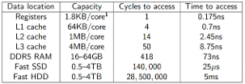

缓存越靠近 CPU：越快、越小，所以L1最小，L3最大、最慢。

**Cache miss = 性能灾难**

如果你写的代码访问数据分散、跳来跳去，那么 CPU 每次都从 RAM 拿 → 慢 400 倍。

### 7.4.4 Branchless Programming

分支（if）会导致 control hazard → pipeline stall，所以在性能关键代码里，会用数学表达式替代 if。
例如：

```text
if (x <= 50)
    y = 10;else
    y = 3;
```
可改写为：`y = 10*(x <= 50) + 3*(x > 50);` 逻辑表达式会自动变成 `0` 或 `1` → 这就是 **predication（谓词化）**。

### 7.4.5 Loop Unrolling（循环展开）

例如复制数组：

```text
    for (i = 0; i < count; i++)
    to[i] = from[i];
```

每次循环都要：检查条件 + 跳转，这样会产生大量 branch hazard。

可以展开：`copy 8 elements at once`；这样每 8 次复制只需要一次分支 → 快多了。

### 7.4.6 Duff's Device（超高级技巧）

这是 loop unrolling + switch + goto 的怪物组合：

```text
switch(count % 8) {
    case 0: do { *to++ = *from++;
    case 7:      *to++ = *from++;
    case 6:      *to++ = *from++;
    ...
    case 1:      *to++ = *from++;
    } while(--n > 0);
}
```

它利用 C 的“case 不自动 break”特性，实现从任意位置进入循环。非常难读，但性能很高。

## 模拟考题

1. Which of the following ISAs would you be most likely to see in a mobile phone?
    ```
    a. ARM
    b. Hack
    c. MIPS
    d. x64
    e. x86-64
    ```

:::details 参考答案
```
a. ARM ≈ RISC：指令更简单，硬件实现更利于低功耗设计（课程通常用这个作为直觉解释）
b. Hack 教学用的ISA
c. MIPS
d. x64 ≈ CISC：传统上更偏桌面/服务器生态，功耗和散热压力更大，不是手机主流
e. x86-64 ≈ CISC：传统上更偏桌面/服务器生态，功耗和散热压力更大，不是手机主流
```
常见ISA与典型平台的对应关系：
- Mobile → ARM
- Desktop / Server → x86-64
- MIPS → 可能出现在历史/嵌入式/教学，但不是现代主流手机
:::

2. Would you be significantly more likely to see the following features in a CPU with a CISC ISA or a RISC ISA? (Select "Both" if it would be likely to appear either way.)
    ```
    a. Low power consumption [RISC]
    b. An instruction to convert two 64-bit integers into two 64-bit floating-point values [CISC]
    c. Efficient memory use [CISC]
    d. Low cooling requirements [RISC]
    e. An instruction to add two registers together and store the result in the third [Both]
    ```
:::details 参考答案
```
a. 更低功耗。RISC指令简单 → 微架构简单 → 更少晶体管 → 更低功耗
b. 将两个64位整数转换为两个64位浮点值的指令。这是一个 “很复杂、做很多事情的一条指令”，复杂指令 = CISC
c. 高效的内存使用。CISC 往往有：变长指令，数据打包（packing）指令。目的是 节省内存空间（code density 高）
d. Cooling requirement（散热需求）本质来自功耗power consumption，而RISC的功耗通常更低。RISC → lower power consumption → lower heat → lower cooling requirements
e. 将两个寄存器相加并将结果存储在第三个寄存器中的指令。
```
:::

3. Which of the following statements are true?

a. The L3 cache is the smallest, fastest memory cache available in a typical CPU.

b. Modern desktop computers rarely use input polling.

c. An ISA following Harvard architecture would generally store programs in separate memory separate to data.

d. In the absence of stalls, a pipelined CPU averages one clock cycle per instruction executed.

e. You have a piece of code that's running too slowly and have narrowed down the problem to the function which reads a file from disk, loading it into memory. It would be sensible to try and optimise this using loop unrolling or rewriting it in assembly. 

:::details 解题思路
a. ×False

b. √True 现代台式计算机很少使用输入轮询

c. √True

d. √True 在没有停顿的情况下，流水线CPU平均每条指令一个时钟周期

e. ×False 你有一段运行太慢的代码，并且已经将问题缩小到“从磁盘读文件到内存”的函数。尝试使用循环展开或在汇编中重写它来优化这一点是明智的。

非常重要的性能思维考点。Disk I/O 延迟：100,000+ cycles；Loop unrolling / assembly：save several cycles，根本不是一个数量级，
- `CPU-bound`：计算很重 → 可能适合 unrolling / SIMD / 汇编 / 算法优化
- `I/O-bound`：等待很重 → 应该减少等待、隐藏等待
- 如果瓶颈是“读磁盘”：
  - 方向 1：减少 I/O 次数（最有效）。合并多个小文件读取 → 一次读大块，避免重复读取（缓存到内存/应用层 cache），减少随机读（random access）→ 改为顺序读（sequential）
  - 方向 2：隐藏 I/O 延迟（latency hiding）。async I/O（异步 I/O）；多线程：一个线程读盘，另一个线程做别的计算；预取（prefetching）：提前发起读取
  - 方向 3：优化数据路径。减少不必要的拷贝（copy）；合理的 buffer 大小；使用内存映射文件（mmap）在合适场景下可能更好（不一定总是）
:::