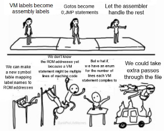

# 09. The Hack VM

Hack VM：把高级语言和 Hack assembly 中间隔开的一层 intermediate representation。

核心思想：

1. 高级语言先翻译成 VM code。
2. VM code 再由 VM translator 翻译成 Hack assembly。
3. Hack assembly 再由 assembler 翻译成 machine code。

```text
High-level language (Jack)
    ↓ front end
Intermediate Representation (Hack VM)
    ↓ back end / VM translator
Hack Assembly
    ↓ assembler
Machine code
```

:::danger 重点
Hack VM 主要目的是让编译器更容易生成代码：表达式、变量段、分支、数组、I/O、函数调用都通过统一的 VM 抽象处理。
:::

## 9.1. Boolean Values

Hack VM 使用 16-bit two's complement。

VM 里的布尔值：

```text
true  = -1 = 0xFFFF = 1111111111111111
false =  0 = 0x0000 = 0000000000000000
```

为什么 `true = -1`？

因为 `-1` 在 16-bit two's complement 里是 all bits set。这样布尔值可以同时作为 bitmask 使用：

```text
x & true  = x
x & false = 0
not false = true
```

:::danger true / false
VM 比较指令 `eq`、`gt`、`lt` 的结果不是 `1/0`，而是 `-1/0`，也就是 `0xFFFF/0x0000`。
:::

## 9.2. Intermediate Representation

**Intermediate Representation (IR)** / 中间表示：介于 high-level language 和 assembly 之间的中间层。

IR 的作用：让 compiler 变得可维护、可扩展、可移植。

编译器通常可以分成三段：

| Phase | Input / Output | Main job |
|---|---|---|
| Front end | High-level language -> IR | 处理语法树、类型、变量作用域，语言相关 |
| Middle end | IR -> optimized IR | 做优化，通常语言无关、硬件无关 |
| Back end | IR -> assembly / machine code | 面向具体 CPU 架构生成代码 |

IR 的好处：

1. 一个语言可以编译到多种 CPU。
2. 多个语言可以共享同一个 optimizer 和 back end。
3. 创建新语言更简单，只需要写新的 front end。

例如现代编译器常见 IR：

1. LLVM IR
2. GIMPLE
3. JVM bytecode
4. Hack VM

:::warning 为什么 IR 重要？
如果没有 IR，每个语言到每个 CPU 都要写一套完整编译器。有 IR 后，可以复用优化器和后端：`Language -> IR -> Target CPU`。
:::

## 9.3. Virtual Machine

**Virtual Machine (VM)** 在这里不是一台真实硬件，而是一个“假装存在的抽象机器”。IR 就像运行在这台抽象机器上。

Hack 使用 VM 的原因：Hack assembly 太低级。

Hack assembly 的限制：

1. 只有一个主要工作寄存器 `D`。
2. 没有函数调用机制。
3. 没有真正的变量作用域。
4. 不能方便地做多文件编译。
5. 写复杂表达式很痛苦。
6. 不能直接表达高级语言里的变量段和对象访问。

Hack VM 提供：

1. Stack：用栈代替单个工作寄存器。
2. Push / pop：统一搬运数据。
3. Arithmetic / logical commands：统一处理表达式。
4. Virtual memory segments：用段抽象变量位置。
5. Branching：`label`、`goto`、`if-goto`。
6. Function call / return：下一章重点。

Hack VM 不负责：

1. 高级变量名。
2. `for` / `while` 语法。
3. 类型系统。
4. 抽象数据类型。
5. `malloc` / `free`。
6. 人类友好的高级语法。

这些是 Jack language 和更高层 compiler front end 的工作。

## 9.4. Hack VM as a Stack Machine

Hack VM 是一种 **stack machine** / 栈机器。

对比 Hack assembly 和 Hack VM：

| Hack Assembly | Hack VM |
|---|---|
| 操作依赖 `A` / `D` / `M` 寄存器 | 操作依赖 stack |
| 程序员要手动控制 `A` 指向哪个 RAM | VM translator 管理地址 |
| 主要用 `D` 寄存器做中间计算 | 运算围绕栈顶完成 |
| 写复杂表达式很麻烦 | 表达式拆成 push/pop 和算术指令 |

Stack 是 LIFO 结构：

```text
Last In, First Out
```

两个基本操作：

1. `push x`：把 `x` 放到栈顶。
2. `pop y`：从栈顶取出一个值，写到 `y` 对应位置。

图示：

```text
----- top -----
|     42      |  ← 最新 push 的值
|      5      |
|      2      |
```

:::danger 栈机器
VM 的 `add`、`sub`、`eq`、`gt`、`lt`、`and`、`or` 等都没有显式参数，因为它们默认操作栈顶的一个或两个值。
:::

## 9.5. Push and Pop

### 9.5.1 `push segment i`

`push local 34` 的意思：

```text
读取 local 段第 34 个位置的值
把这个值压入栈顶
```

你不关心 `local 34` 在真实 RAM 的哪个地址。VM translator 会把虚拟段地址翻译成物理地址。

### 9.5.2 `pop segment i`

`pop local 35` 的意思：

```text
从栈顶弹出一个值
写入 local 段第 35 个位置
```

例如栈顶是 `255`：

```text
pop local 35
=> RAM[local_base + 35] = 255
```

注意：VM 没有“丢弃栈顶”的裸 `pop`。

```text
pop
```

这是非法语法。必须指定写到哪里：

```text
pop temp 0
```

这常被用作“丢弃栈顶值”的技巧。

### 9.5.3 Copying variables

VM 里没有这种语法：

```text
local 250 = local 4
```

要用 push / pop：

```text
push local 4
pop local 250
```

:::warning push / pop
`push` 是从某段读值到栈顶；`pop` 是从栈顶写回某段。VM 里的数据搬运基本都靠这两个命令。
:::

## 9.6. Arithmetic and Logical Commands

Hack VM 规定：

1. 二元运算：`add`、`sub`、`eq`、`lt`、`gt`、`and`、`or` 会弹出两个值。
2. 一元运算：`neg`、`not` 只弹出一个值。
3. 结果都会重新 push 回栈顶。

二元运算通用模式：

```text
x = pop()
y = pop()
push(y op x)
```

注意：第二个 pop 出来的 `y` 是左操作数，第一个 pop 出来的 `x` 是右操作数。

:::danger 操作数顺序
`sub`、`lt`、`gt` 对顺序敏感。VM 语义是 `y op x`，不是 `x op y`。
:::

### 9.6.1 `add`

计算 `local 0 + local 1`：

```text
push local 0
push local 1
add
```

栈变化：

```text
push local 0  -> [local0]
push local 1  -> [local0, local1]
add           -> push(local0 + local1)
```

### 9.6.2 `sub`

`sub` 的语义：

```text
x = pop()
y = pop()
push(y - x)
```

例如计算 `local 50 = local 50 * 2 + 2`，因为 VM 没有乘法，可以用加法实现 `* 2`：

```text
push local 50
push local 50
add
push constant 2
add
pop local 50
```

### 9.6.3 `neg`

`neg` 是一元运算：

```text
x = pop()
push(-x)
```

例子：

```text
push constant 6
neg
```

结果栈顶变成 `-6`。

### 9.6.4 `eq`, `lt`, `gt`

比较指令也遵循栈顶操作。

`eq`：

```text
x = pop()
y = pop()
if (y == x) push(-1) else push(0)
```

`lt`：

```text
push(y < x ? -1 : 0)
```

`gt`：

```text
push(y > x ? -1 : 0)
```

例子：

```text
push constant 3
push constant 10
lt
```

栈行为：

```text
y = 3
x = 10
3 < 10 -> true -> push(-1)
```

### 9.6.5 `and`, `or`, `not`

这些是 bitwise operations。

`and`：

```text
push(pop() & pop())
```

例子：

```text
push constant 6   // 110
push constant 3   // 011
and               // 010
```

结果是 `2`。

`or`：

```text
push(pop() | pop())
```

`not`：

```text
x = pop()
push(~x)
```

注意：`not` 是按位取反，不是普通布尔取反。

```text
push constant 0
not
```

结果：

```text
1111111111111111 = -1 = true
```

## 9.7. Expression Example

题目：用 Hack VM 判断：

```text
local 3 > 42 and local 3 < local 5 - 100
```

思路：

1. 先计算 `local 5 - 100`。
2. 判断 `local 3 < (local 5 - 100)`。
3. 判断 `local 3 > 42`。
4. 两个布尔结果都在栈上后，用 `and` 合并。

VM 代码：

```text
// compute local 5 - 100
push local 5
push constant 100
sub

// check local 3 < (local 5 - 100)
push local 3
gt

// check local 3 > 42
push local 3
push constant 42
gt

// combine both boolean results
and
```

:::warning 做题方法
VM 表达式题不要试图一步写出高层表达式。先把每个子表达式拆成 push / arithmetic / logical commands，最后让栈顶留下结果。
:::

## 9.8. Branching

Hack VM 支持三种控制流指令：

```text
label LABEL_NAME
goto LABEL_NAME
if-goto LABEL_NAME
```

含义：

| Command | Meaning |
|---|---|
| `label LABEL_NAME` | 在当前位置声明标签 |
| `goto LABEL_NAME` | 无条件跳转 |
| `if-goto LABEL_NAME` | 弹出栈顶；如果值不是 0，则跳转 |

`if-goto` 的关键：

```text
value = pop()
if value != 0:
    goto LABEL_NAME
```

与 Hack assembly 对比：

| Hack Assembly | Hack VM |
|---|---|
| 比较 `D` register | 比较栈顶值 |
| `D;JNE` | `if-goto SOME_LABEL` |
| 条件：`D != 0` | 条件：pop 出来的值 `!= 0` |

:::danger if-goto
先用算术/逻辑指令把条件算成 `true/false` 压栈，再用 `if-goto` 根据栈顶值跳转。
:::

## 9.9. Virtual Memory and Segments

Hack assembly 直接用 physical RAM address。Hack VM 使用 virtual memory segments。

VM translator 负责把：

```text
segment + index
```

翻译成具体 RAM 地址。

Hack VM 有 8 个主要 segments：

| Segment | Meaning |
|---|---|
| `constant` | 不是实际内存，`push constant k` 直接把 `k` 压栈 |
| `local` | 当前函数局部变量 |
| `argument` | 当前函数参数 |
| `this` | 通过 `pointer 0` 映射到一段 RAM |
| `that` | 通过 `pointer 1` 映射到一段 RAM |
| `pointer` | 只有 `pointer 0` 和 `pointer 1`，控制 `THIS` / `THAT` |
| `temp` | 固定的小 RAM 区，给编译器临时使用 |
| `static` | 静态/全局变量，函数返回后仍保留 |

### 9.9.1 `local` vs `constant`

`local i`：

1. 是可读写的虚拟内存位置。
2. 将来映射到某段真实 RAM。
3. 用来保存局部变量。

`constant i`：

1. 不对应 RAM。
2. 是立即数。
3. 只能用于 `push`，不能 `pop constant i`。

```text
push constant 5
```

意思是“把数字 5 压栈”，不是真的去内存里读 `constant[5]`。

:::danger constant
`constant` 是最容易和普通 memory segment 搞混的。它不是内存段，只是把字面量压栈。
:::

## 9.10. Pointer, This, That

VM 不支持这种间接寻址：

```text
push local (local 0)
```

如果要访问数组第 `i` 个元素，就要用 `pointer` + `this/that` 来实现 base address + offset。

### 9.10.1 `this`

基本关系：

```text
this i maps to RAM[pointer 0 + i]
```

也就是：

```text
this 0 -> RAM[pointer 0]
this 1 -> RAM[pointer 0 + 1]
this 2 -> RAM[pointer 0 + 2]
```

`pointer 0` 存的是 `this` 段的 base address。

### 9.10.2 Array access example

假设：

1. 数组存放在 `RAM[0x0800]` 到 `RAM[0x08FF]`。
2. `0x0800 = 2048`。
3. `local 0` 存着数组下标 `i`。
4. 目标：把数组第 `i` 个元素压栈。

步骤：

```text
push constant 2048   // array base address
push local 0         // i
add                  // 2048 + i
pop pointer 0        // pointer 0 = 2048 + i
push this 0          // RAM[2048 + i]
```

流程：

```text
array base + index
    ↓
pop pointer 0
    ↓
this 0 now maps to RAM[base + index]
    ↓
push this 0 / pop this 0
```

:::danger 数组访问
Hack VM 没有 `array[i]` 语法。数组访问的本质是：算出物理地址，放入 `pointer 0` 或 `pointer 1`，再通过 `this 0` / `that 0` 访问。
:::

### 9.10.3 Why `that` is needed

Hack I/O 地址：

| Device | Physical RAM |
|---|---|
| Screen | `RAM[0x4000]` 到 `RAM[0x5FFF]` |
| Keyboard | `RAM[0x6000]` |

理论上可以用 `this` 访问键盘：

```text
push constant 24576   // 0x6000
pop pointer 0
push this 0
```

但规范限制 `this` 主要映射到 `RAM[0x0800]` 到 `RAM[0x3FFF]`。访问 screen / keyboard 这种 I/O 区域要用 `that`。

`that` 的关系：

```text
that i maps to RAM[pointer 1 + i]
```

访问键盘：

```text
push constant 24576   // 0x6000 keyboard address
pop pointer 1         // pointer 1 = 0x6000
push that 0           // read RAM[0x6000]
```

`this` 和 `that` 的区别：

| Segment | Base pointer | Typical use |
|---|---|---|
| `this` | `pointer 0` / `THIS` | 对象、数组、常规 heap 区 |
| `that` | `pointer 1` / `THAT` | 另一段 RAM，常用于 screen / keyboard |

## 9.11. VM Translator Basics

VM translator 需要处理 VM 语法。

VM token 类型：

1. Keywords：`push`、`pop`、`add`、`sub`、`neg`、`and`、`or`、`not`、`eq`、`gt`、`lt`
2. Segments：`local`、`constant`、`this`、`that`、`pointer`、`argument`、`static`、`temp`
3. Control flow：`label`、`goto`、`if-goto`
4. Function-related：`function`、`call`、`return`
5. Integer literals：十进制 `0..32767`
6. Identifiers：label / function names
7. Newlines：每条 VM command 一行

### 9.11.1 Labels do not need a VM symbol table

Hack assembly assembler 需要处理 label symbol table。我们翻译时要：
- 第一遍扫文件，记录所有 (LABEL) 的 ROM 地址到 符号表；
- 第二遍遇到 @LABEL 时，才能把它替换成具体地址。



但 VM translator 通常不需要为 VM label 再建一套符号表，因为：

```text
VM label / goto / if-goto
    ↓
Hack assembly label + jump
    ↓
assembler 再处理 assembly label
```

也就是说，VM translator 可以直接把 VM label 翻译成 Hack assembly label，让 assembler 处理最终 ROM address。

:::warning VM parser
VM 里的 `label foo` / `goto foo` / `if-goto foo`，翻译完之后都会变成 Hack 汇编里的 label + 跳转指令，而 Hack 汇编的 assembler 自己会再做一遍“建符号表 + 解析 label”，所以 VM translator 自己不需要为 label 再建一份符号表（除非你想做特别炫酷的错误提示）。
:::

### 9.11.2 LL(1) grammar

VM 语法很简单，一看第一个 keyword 就知道该怎么解析。

一条 VM instruction 可以是：

```text
push / pop + segment + integer
add | sub | neg | and | or | not | eq | gt | lt
label id | goto id | if-goto id
function id n | call id n | return
```

`push` / `pop` 的 data 格式：

```text
segment integer
```

例如：

```text
push local 3
pop temp 0
```

:::warning VM parser
VM parsing 本身不难。难点在于：解析之后如何把每条 VM command 正确翻译成 Hack assembly。
:::

## 9.12. Base Address + Offset

虚拟段映射到物理 RAM 的基本模型：

```text
physical address = base address + offset
```

以 `local` 为例，如果 `local` 段从物理 RAM 地址 `300` 开始：

```text
local 0 -> RAM[300]
local 1 -> RAM[301]
local 2 -> RAM[302]
...
local i -> RAM[300 + i]
```

其中：

1. `300` 是 base address。
2. `i` 是 offset。

这和 `this` / `that` 一样：

```text
pointer 0 stores base address of this
pointer 1 stores base address of that
```

### 9.12.1 Physical limit

VM 假装每个 segment 很大、stack 也很大，但 Hack 硬件只有有限 RAM。

所以实际系统必须限制每个段的大小。越界访问在真实系统中会导致 segmentation fault；Hack 没有硬件异常机制，所以课程里主要靠程序员自己避免越界。

### 9.12.2 C array analogy

C 里的数组也是 base + offset。

```c
long long myArray[128];
```

在 64-bit 机器上，`long long` 是一个 machine word。

```text
myArray[50]  = address(myArray) + 50
myArray[128] = address(myArray) + 128  // out of bounds
```

这和 Hack VM 的 segment access 是同一个模型，只是 C compiler 帮你计算地址。

## 9.13. Actual RAM Mapping in Hack

Hack VM translator 把虚拟段放进 Hack physical RAM。

关键基址变量：

| RAM address | Keyword | Usage |
|:---|---|---|
| `RAM[0]` | `SP` | stack pointer，指向栈顶下一格 |
| `RAM[1]` | `LCL` | `local` segment base |
| `RAM[2]` | `ARG` | `argument` segment base |
| `RAM[3]` | `THIS` | `this` segment base，也就是 `pointer 0` |
| `RAM[4]` | `THAT` | `that` segment base，也就是 `pointer 1` |
| `RAM[5..12]` | `temp` | 8 个 temp slots |
| `RAM[16..255]` | `static` | static segment，最多 240 个 slots |
| `RAM[256..2047]` | stack | stack，以及调用时切出的 local / argument 空间 |
| `RAM[2048..16383]` | heap | 可以映射给 `this` / `that` |
| `RAM[16384..24575]` | SCREEN | screen memory map |
| `RAM[24576]` | KBD | keyboard memory map |

:::danger RAM mapping
这个表格非常关键：把“虚拟段”具体放进 0–24576 的物理 RAM 地址中。`SP/LCL/ARG/THIS/THAT` 都是存在 RAM 里的“基址变量”。`pointer 0/1` 本质上就是直接操作 `THIS/THAT`。
:::

## 9.14. Segment Translation Rules

VM translator 翻译 push / pop 的概念规则：

| VM command | Translation idea |
|---|---|
| `push local i` | read `RAM[LCL + i]`, push it |
| `pop local i` | pop stack top into `RAM[LCL + i]` |
| `push argument i` / `pop argument i` | same, but base is `ARG` |
| `push this i` / `pop this i` | same, but base is `THIS` |
| `push that i` / `pop that i` | same, but base is `THAT` |
| `push pointer 0` / `pop pointer 0` | read / write `THIS` |
| `push pointer 1` / `pop pointer 1` | read / write `THAT` |
| `push temp i` / `pop temp i` | use `RAM[5 + i]` |
| `push static i` / `pop static i` | use assembly symbol `FileName.i` |
| `push constant k` | push number `k`; do not read RAM |

## 9.15. Stack Implementation

Hack VM 的 stack 在物理内存里是一段连续 RAM：

```text
RAM[256..2047]
```

`SP = RAM[0]`，永远指向“下一个要写入的栈位置”。

### 9.15.1 `push x`

底层语义：

```text
RAM[SP] = x
SP = SP + 1
```

### 9.15.2 `pop address`

底层语义：

```text
SP = SP - 1
RAM[address] = RAM[SP]
```

不需要把旧的 `RAM[SP]` 清零，因为那块位置已经被视为 stack 保留区，下一次 `push` 会覆盖。

:::danger SP
`SP` 指向的不是当前栈顶元素，而是“下一格空位”。所以 `push` 先写 `RAM[SP]` 再 `SP++`；`pop` 先 `SP--` 再读 `RAM[SP]`。
:::

## Exam Review

这一章适合按这些问题复习：

1. 为什么 compiler 要引入 IR？
2. Front end / middle end / back end 分别做什么？
3. Hack VM 为什么是 stack machine？
4. `push` 和 `pop` 的语义分别是什么？
5. 二元运算为什么是 `y op x`？
6. 为什么 VM 的 `true` 是 `-1`？
7. `if-goto` 如何根据栈顶值跳转？
8. `constant` 为什么不是真实内存段？
9. `pointer 0/1`、`this`、`that` 的关系是什么？
10. 如何用 `this` 或 `that` 实现数组 / I/O 访问？
11. Hack VM 的 8 个 segments 分别是什么？
12. `SP/LCL/ARG/THIS/THAT` 在 RAM 中的地址和作用是什么？

:::danger 高频考点
重点背：`true=-1 false=0`、stack machine、push/pop 语义、二元运算顺序、8 个 segments、`this/that + pointer`、base address + offset、Hack RAM mapping、`SP` 指向下一格空位。
:::
