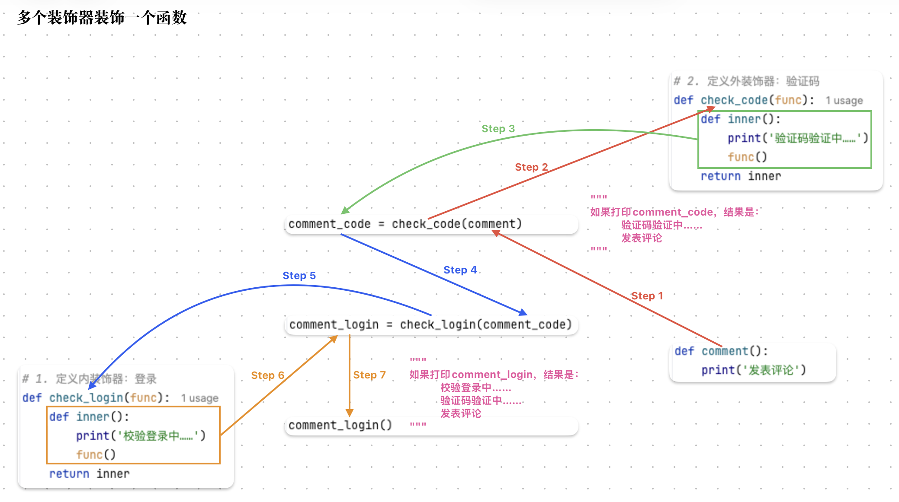
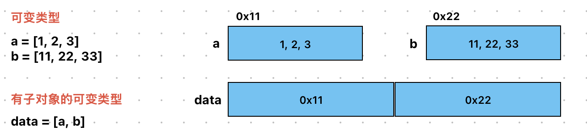
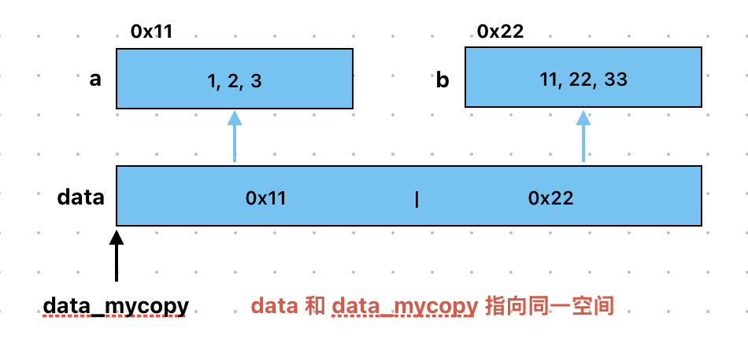
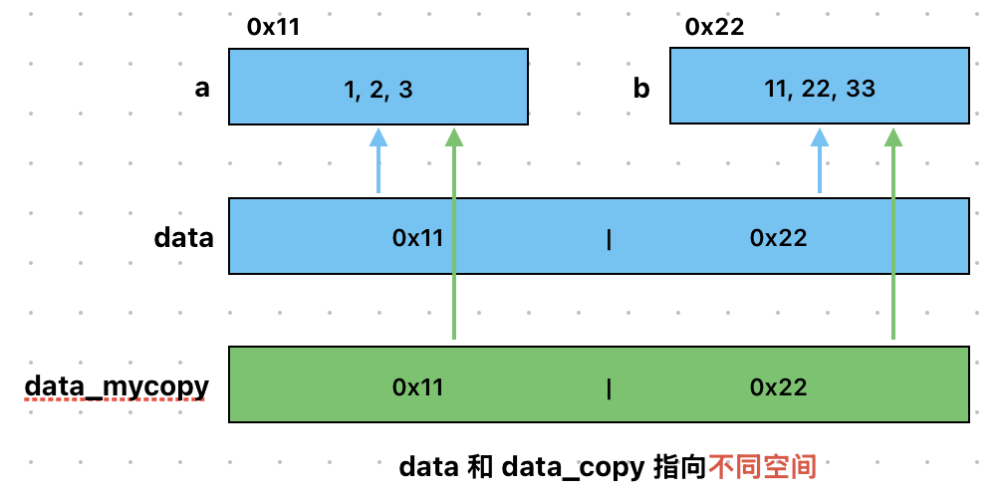

# 第三章 Python闭包装饰器与深浅拷贝
* 闭包（closure）指的是内层函数记住外层函数变量的机制。
* 装饰器（decorator）可以在不修改原函数代码的情况下，给函数增加新功能。
* 在 Python 中，函数（function）可以作为参数传给另一个函数。
* 闭包中的内层函数可以访问外层函数的变量（variable）。
* 内层函数（inner function）定义在另一个函数里面。
* 外层函数（outer function）负责创建并返回内层函数。
* 外层函数通过 return 返回内层函数。
* 浅拷贝（shallow copy）只复制最外层对象。
* 深拷贝（deep copy）会复制外层对象和内部可变对象。
* 列表 list 是一种可变对象（mutable object）。
* 数字、字符串和元组通常属于不可变对象（immutable object）。
* 可以用 id() 查看对象的内存地址（memory address）。
* 浅拷贝后，内部可变对象仍然是共享的（shared）。
* 深拷贝后，新对象和原对象是独立的（independent）。 

## 3.1 Closure
1. 作用：闭包可以保存函数内的变量，该变量不会随着调用函数结束被销毁。 
2. 语法：在函数嵌套的前提下，内部函数使用了外部函数的变量，并且外部函数返回了内部函数，这种外部函数变量的内部函数称为闭包。
    ```
    # 外部函数
    def 外部函数名（外部函数/形参列表）:
        外部函数的（局部）变量

        # 内部函数
        def 内部函数名（内部参数/形参列表）:
            ...[使用外部函数的变量]

        return 内部函数名
    ```
    注意区分：
    ```
    函数名：表示函数对象
    函数名()：表示调用函数，获取返回值
    ```
3. 构成条件：
   * 有嵌套：在函数嵌套（函数里面再定义函数）的前提下；
   * 有引用：内部函数使用了外部函数的变量（还包括外部函数的参数）；
   * 有返回：外部函数返回了内部函数名。
4. 案例分析：定义一个用于求和的闭包，其中，外部函数有参数 `num1` ，内部函数有参数 `num2` ，然后调用，并用于求解两数之和，观察效果。
    ```python
    # 案例1：函数名 是 对象
    def get_sum(a, b):
        return a + b

    print(get_sum)  # <function get_sum at 0x102e8f480> 说明：函数名 = 对象
    print(get_sum(2, 3)) # 5 说明：函数名() = 调用函数，获取返回值

    # 函数名可以赋值给变量，这个变量就是：函数对象
    my_sum = get_sum
    print(my_sum)   # <function get_sum at 0x104b97480> 说明：重新定义了一个函数
    print(my_sum(2, 3)) # 5 说明：重新定义的函数跟之前的函数功能一致

    # 案例2：演示闭包写法
    # 定义外部函数
    def func_outside(num1):
        # 定义内部函数
        def func_inner(num2):           # 有嵌套
            # 求和
            sum = num1 + num2           # 有引用
            print(f'求和结果是 {sum}')

        return func_inner               # 有返回

    # 调用上述函数
    func_inner = func_outside(10)
    func_inner(1)   # 11
    func_inner(1)   # 11
    func_inner(1)   # 11
    print('-' * 20)

    func_outside(100)(200)
    ```

### 3.1.2 nonlocal
1. `global`: 声明全局变量
2. `nonlocal`: python内置关键字，声明能够让内部函数去修改外部函数的变量
3. 案例分析：编写一个闭包，让内部函数访问外部函数内的参数 `a = 100` ，观察效果

## 3.2 Decorator
### 3.2.1 作用
在不改变原有函数的基础上，给该函数增加额外功能。装饰器本质上就是一个闭包函数。

### 3.2.2 构成条件
1. 有嵌套：在函数嵌套（函数里面再 定义函数）的前提下
2. 有引用：内部函数使用了外部函数的变量（好包括外部函数的参数）
3. 有返回：外部函数返回了内部函数名
4. 有额外功能：给需要装饰的原有函数增加额外功能

### 3.2.3 传统方式 和 语法糖
1. 传统方式：变量名 = 装饰器名（原函数名）
   ```python
   案例分析：定义有发表评论功能的函数，然后再不改变原函数的基础上，提示用户要先登录
    # 1. 定义外部函数，形参列表接收 要被装饰的函数名，即对象
    def check_login(func_name):
        # 1.1 定义内部函数
        def func_inner():       # 有嵌套
            # 1.2 额外功能
            print('校验登录... 登录成功！')
            # 1.3 访问原函数，即外部函数的引用
            func_name()         # 有引用
        return func_inner       # 有返回

    # 2. 定义函数，表示发表评论
    def comment():
        print('this is a comment')

    def payment():
        print('The user is paying...')
   ```

2. 语法糖：在要被装饰的原函数上，直接写 `@decorator` 之后直接调用原函数。
    ```python
    @check_login        # 底层其实是 payment_d = check_login(payment) 的简化版
    def payment():
        print('The user is paying...')
    ```

## 3.3 装饰器的使用
函数分类：
1. 无参无返回的函数
    ```
    定义：def fuction(): ...
    调用：function()
    ```
    需求：在**无参无返回值**的原有求和函数 `get_sum()` 计算结果之前，添加一个友好提示（注意：不能改变源码）：正在努力计算中...
    ```python
    def my_decorator(func_name):
    # 1.1 定义内部函数，其格式必须和原函数保持一致
    def func_inner():               # 有嵌套
        # 1.2 添加提示信息（额外功能）
        print('accurate...')        # 有额外功能
        # 1.3 调用原函数
        func_name()                 # 有引用
    # 1.4 返回内部函数(对象)
    return func_inner               # 有返回

    @my_decorator
    def get_sum():      # no parameter
        a = 10
        b = 20
        sum = a + b
        # return sum      # return value
        print(f'sum求和结果是：{sum}') # return none
    ```
2. 有参无返回的函数
    ```
    定义：def fuction(parameter): ...
    调用：function(argument)
    ```
    需求：在**有参无返回值**的原有求和函数 `get_sum()` 计算结果之前，添加一个友好提示（注意：不能改变源码）：正在努力计算中...
    ```python
    # 1. 定义装饰器
    def my_decorator(func_name):
        # 1.1 定义内部函数，其格式必须和原函数保持一致
        def func_inner(x, y):           # 有嵌套
            # 1.2 添加提示信息（额外功能）
            print('accurate...')        # 有额外功能
            # 1.3 调用原函数
            func_name(x, y)             # 有引用
        # 1.4 返回内部函数(对象)
        return func_inner               # 有返回

    # 2. 定义原函数(有参无返回)
    @my_decorator
    def get_sum(a, b):      # no parameter
        sum = a + b
        # return sum      # return value
        print(f'sum求和结果是：{sum}') # return none
    ```
3. 无参有返回的函数
    ```
    定义：def fuction(): ... return value
    调用：用变量接收返回值 = function()
    ```
    需求：在**无参有返回值**的原有求和函数 `get_sum()` 计算结果之前，添加一个友好提示（注意：不能改变源码）：正在努力计算中...
    ```python
    # 1. 定义装饰器
    def my_decorator(func_name):        # func_name 是要被装饰的原函数名
        # 1.1 有嵌套：定义内部函数，其格式必须 = 被装饰的原函数
        def func_inner():
            # 1.2 有额外功能：添加提示信息（额外功能）
            print('accurate...')
            # 1.3 有引用：调用原函数(内部函数是有返回)
            return func_name()
        # 1.4 有返回：返回内部函数(对象)
        return func_inner

    # 2. 定义原函数(无参有返回)
    @my_decorator
    def get_sum():      # no parameter
        a = 10
        b = 20
        return a + b    # return value
        print(f'sum求和结果是：{sum}') # return none
    ```
4. 有参有返回的函数
    ```
    定义：def fuction(parameter): ... return value
    调用：用变量接收返回值 = function(argument)
    ```
    需求：在**有参有返回值**的原有求和函数 `get_sum()` 计算结果之前，添加一个友好提示（注意：不能改变源码）：正在努力计算中...
    ```python
    # 1. 定义装饰器
    def my_decorator(func_name):
        # 1.1 有嵌套: 定义内部函数，其格式必须和原函数保持一致
        def func_inner(x, y):
            # 1.2 有额外功能: 添加提示信息（额外功能）
            print('accurate...')
            # 1.3 有引用: 调用原函数（返回原函数）
            return func_name(x, y)
        # 1.4 有返回: 外部函数 返回 内部函数(对象)
        return func_inner

    # 2. 定义原函数(有参有返回)
    @my_decorator
    def get_sum(a, b):  # have parameter
        return a + b    # return value
    ```
5. 通用装饰器的使用
    ```
    *args: 元组类型
    **kwargs: 字典类型
    ```
    需求：定义一个可以计算**多个数据和多个字典值之和**的函数，并调用。在原函数的计算结果之前，添加一个友好提示（注意：不能改变源码）：正在努力计算中...
    ```python
    # 1. 定义装饰器
    def my_decorator(func):
        def inner(*args, **kwargs):
            print("accurating now...")
            return func(*args, **kwargs)
        return inner

    # 2. 定义原函数
    @my_decorator
    def get_sum(*args,**kwargs):
        """
        该函数用于计算 数字元祖 和 字典value值 之和
        :param args: 数字元祖。 *args表示接收所有位置参数，封装到元组中
        :param kwargs:字典，键是字符串，值是数字
        :return:结果之和
        """
        # 2.1 求和变量
        sum = 0
        # 2.2 遍历元祖，获取每个元素，求和
        for i in args:
            sum += i
        # 2.3 遍历字典，获取到每个值
        for j in kwargs.values():
            sum += j
        # 2.4 返回结果
        return sum

        # 上述代码可以简化为下面的公式：
        return sum(args) + sum(kwargs.values())
    ```

## 3.4 进阶案例：多个装饰器的使用
* 离函数最近的装饰器先装饰，然后外面的装饰器在装饰，**由内到外**的装饰过程。
* 多个装饰器装饰一个函数（案例）：在发表评论前，都需要 登录用户 → 验证码验证。所以是定义 有发表评论的功能函数，然后在不改变原函数的基础上，需要 先检查用户登录 和 输入验证码。
    
* 代码
  ```python
    # 1. 定义内装饰器：登录
    def check_login(func):
        def inner():
            print('校验登录中……')
            func()
        return inner

    # 2. 定义外装饰器：验证码
    def check_code(func):
        def inner():
            print('验证码验证中……')
            func()
        return inner

    # 3. 定义原函数：发表评论
    # @check_login
    # @check_code
    def comment():          # no parameter, no return
        print('发表评论')

    # 4. 测试
    # 4.1 传统写法
    comment_code = check_code(comment)
    comment_login = check_login(comment_code)
    comment_login()

    # 4.2 语法糖
    # comment()
  ```

## 3.5 进阶案例：带参数的装饰器
需求：定义一个 **既能装饰减法运算**，又能**装饰加法运算** 的装饰器，即带参数的装饰器。
```python
# 1. 定义装饰器
# def my_decorator(func, flag):       # func: 原函数  flag: 标记  报错，因为装饰器的参数只能有一个
def logging(flag):
    def my_decorator(func):
        def inner(a, b):
            if flag == '+':
                print('正在计算[加法]中……')
            elif flag == '-':
                print('正在计算[减法]中……')
            return func(a, b)
        return inner
    return my_decorator

# 2. 定义原函数：加法运算
@logging('+')
def get_sum(a, b):
    return a + b

# 3. 定义原函数：减法运算
@logging('-')
def get_sub(a, b):
    return a - b
```
使用带参数的装饰器，其实是在装饰器的外面包裹一个函数，使用该函数接收参数，返回装饰器。
1. 编写多个装饰器的代码过程是？
   * 离函数最近的装饰器先装饰，外面的装饰器后装饰，由内到外的装饰过程。 
2. 编写带参数的装饰器，代码过程是？
   * 使用带参数的装饰器，是在装饰器外部再包裹一个函数，使用该函数接收参数，返回装饰器。

## 3.6 深浅拷贝
### 3.6.1 可变与不可变类型
1. 可变对象：可以修改的对象，包括列表、字典、集合；
   * 该对象所指向的内存中的值可以被改变。变量（即引用）改变后，实际上是其所指的值直接发生改变，并没有发生复制行为，也没有开辟新的地址（即原地改变）。
2. 不可变对象：一旦创建就不可修改的对象，包括字符串、元组、数值类型（整型，浮点型）；
   * 该对象所指向的内存中的值不能被改变。当改变某个变量时，由于其所指的值不能被改变，相当于把原来的值复制一份后再改变，这会开辟一个新的地址，变量再指向这个新的地址。
3. 变量赋值执行原理：`a = "python"` ，其中，python解释器做的事情是：
   1. 创建变量
   2. 创建一个对象（分配一块内存）来存储值 `"python"`
   3. 将变量与对象，通过指针连接起来，从变量到对象的连接称之为引用

### 3.6.2 浅拷贝，原始数据准备
浅拷贝：创建新对象，其内容是原对象的引用（浅拷贝之所以被称之为”浅“，是它仅仅拷贝一层，拷贝了**最外围的对象本身**，内部元素只拷贝一个引用）。

原始数据：


### 3.6.3 可变类型浅拷贝
普通赋值：`data_mycopy = data`


浅拷贝：`data_copy = copy.copy(data)`


完整代码：
```python
"""
深浅拷贝

浅拷贝                  深拷贝
copy模块的copy()函数     copy模块的deepcopy()函数；
拷贝的多                拷贝的少
只拷贝第一层（可变）      拷贝所有层（可变）

如果针对的是不可变类型，则深浅拷贝的用法和普通赋值一样，没有区别。
"""

import copy     # 导包

def dm01_assignValue():
    # 普通赋值（不可变类型）
    a = 10
    b = a
    print('id(a)→', id(a))      # 0x01
    print('id(b)→', id(b))      # 0x01
    print('id(10)→', id(10))    # 0x01

    # 普通赋值（可变类型）
    a = [1, 2, 3]
    b = [11, 22, 33]
    c = [a, b]
    d = c
    print('id(c)→', id(c))      # 0x02
    print('id(d)→', id(d))      # 0x02

def dm02_shallowCopyMutable():
    # 普通赋值（可变类型）
    a = [1, 2, 3]               # 0x01
    b = [11, 22, 33]            # 0x02
    c = [6, 7, a, b]            # 0x03
    d = copy.copy(c)            # shallow copy

    # 测试1
    print('id(c)→', id(c))      # 0x03
    print('id(d)→', id(d))      # 0x04

    # 测试2
    print(id(c[2]))             # 0x01, 因为2是在a里面的值
    print(id(a))                # 0x01

    # 测试3: 修改a[2] = 22
    a[2] = 22
    print('c →', c)      # [6, 7, [1, 2, 22], [11, 22, 33]]
    print('d →', d)      # [6, 7, [1, 2, 22], [11, 22, 33]]

def dm03_shallowCopyImmutable():
    # immutable type 不可变类型 a b c
    a = (1, 2, 3)       # 0x01
    b = (11, 22, 33)    # 0x02
    c = (6, 7, a, b)    # 0x03
    d = copy.copy(c)    # 0x03

    print('id(c)→', id(c))  # 0x03
    print('id(d)→', id(d))  # 0x03

def dm04_deepCopyMutable():         # 深拷贝会拷贝可变类型的所有层
    a = [1, 2, 3]       # 0x01
    b = [11, 22, 33]    # 0x02
    c = [6, 7, a, b]    # 0x03
    d = copy.deepcopy(c) # deepcopy

    # 测试1
    print('id(c)→', id(c))  # 0x03
    print('id(d)→', id(d))  # 0x04

    # 测试2
    a[1] = 100
    b[1] = 400
    print(f'c: {c}')    # [6, 7, [1, 100, 3], [11, 400, 33]]
    print(f'd: {d}')    # [6, 7, [1, 2, 3], [11, 22, 33]]

def dm05_deepCopyImmutable():
    # immutable type 不可变类型 a b c
    a = (1, 2, 3)           # 0x01
    b = (11, 22, 33)        # 0x02
    c = (6, 7, a, b)        # 0x03
    d = copy.deepcopy(c)    # 0x03

    print('id(c)→', id(c))  # 0x03
    print('id(d)→', id(d))  # 0x03

if __name__ == '__main__':
    # dm01_assignValue()    # 普通赋值
    # dm02_shallowCopyMutable()   # 重点：浅拷贝拷贝可变类型
    # dm03_shallowCopyImmutable()
    # dm04_deepCopyMutable()      # 重点：深拷贝拷贝可变类型
    # dm05_deepCopyImmutable()
```

## 3.7 核心词解释
1. parameter 形参：方法定义时写在括号里的变量，用来“接收外部传进来的值”。
    ```python
    void greet(String name) {                   # name = parameter
        System.out.println("Hello " + name);
    }
    ```
2. argument 实参：调用方法时真正传进去的值。
    ```python
    int add(int a, int b) {   // a 和 b 是形参
        return a + b;
    }

    int result = add(3, 5);   // 3 和 5 是实参
    ```