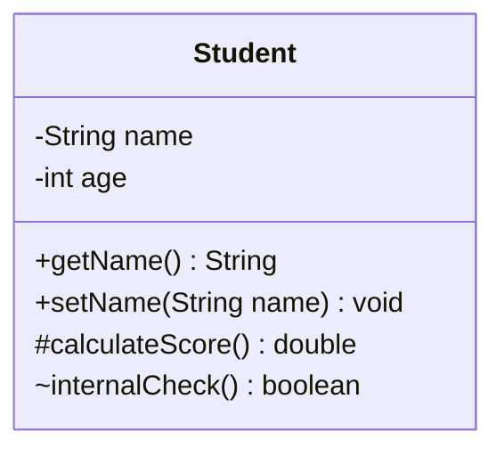
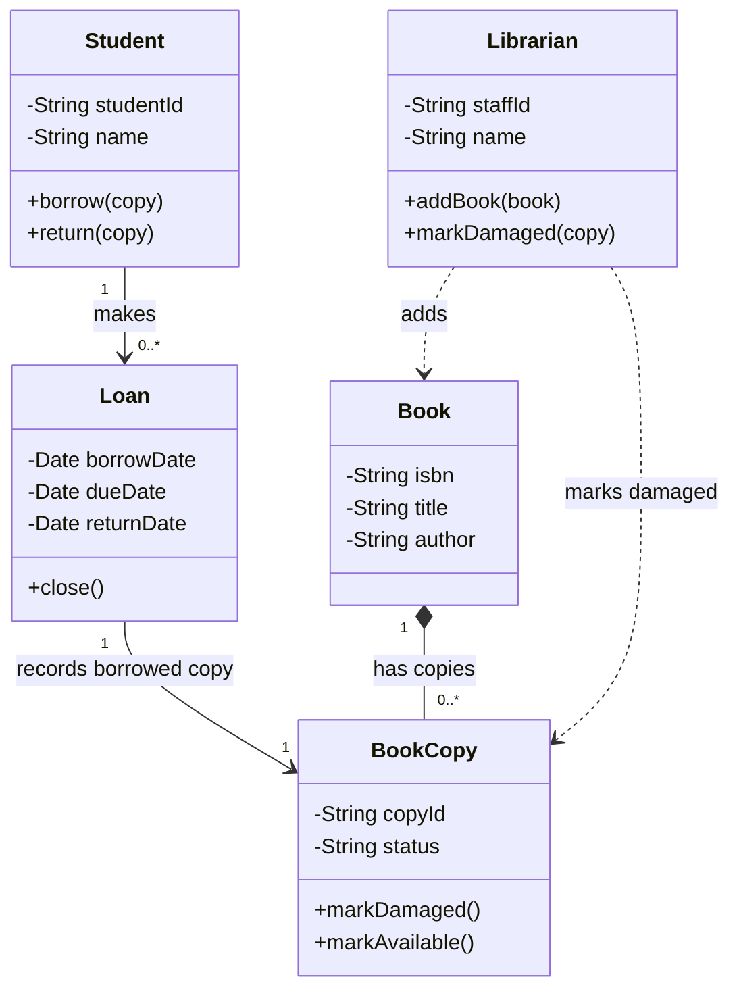
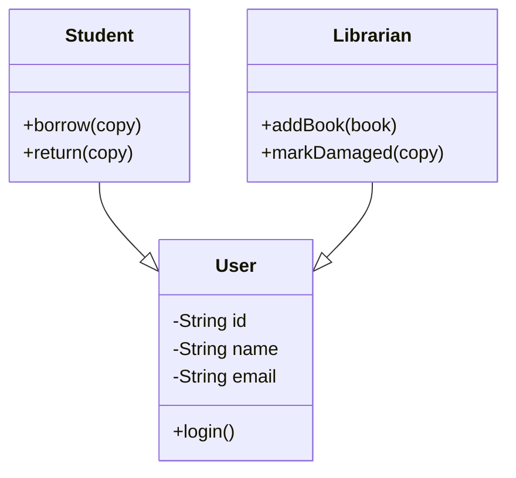
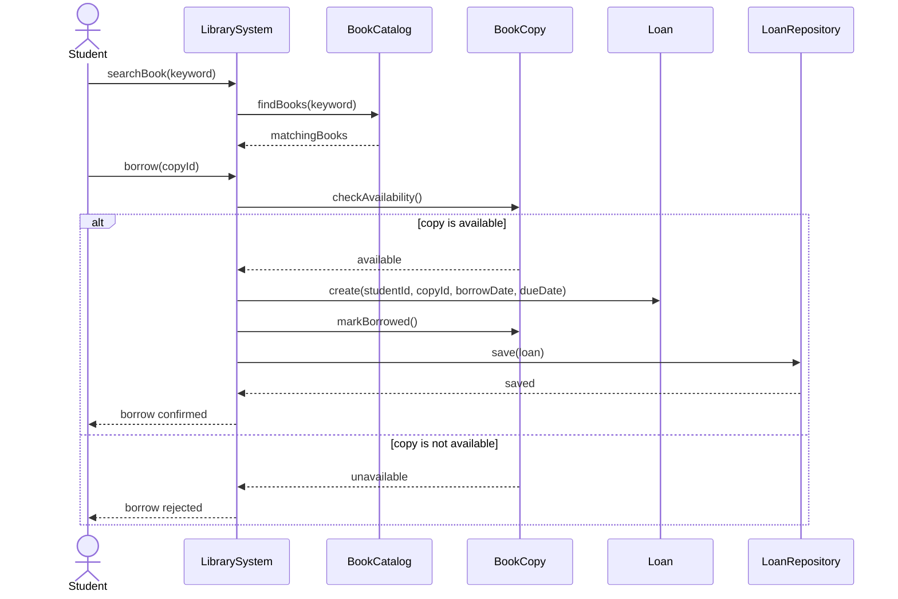

# 4. Object-Oriented Design

这一章的内容如果认真研究一下，非常简单，画图题里面一定会出一道大题。

1. Class：对象类型的蓝图，例如 Car。
2. Object：某个 class 的具体实例，例如一辆有注册号的 Ford Fusion。
3. Method / Operation：对象能执行的行为。
4. Attribute：对象保存的数据或状态。

## 4.1 OO Design Principles
画图之后会有一些子问题，所以要完全清楚这些principle的具体含义。

1. Encapsulation
封装：把对象的数据和行为放在对象内部，外部通过允许的方法访问。这样可以保护数据一致性，例如 private 字段只能通过 getter 或受控方法读取和修改。

2. Abstraction
抽象：关注核心问题，省略不必要的细节，只公开必要信息，并隐藏对象内部复杂性。游戏项目里可以把 Door、Button、MovingPlatform 抽象成 Interactable，让主循环只调用 update、render 或 onPlayerCollide。

3. Inheritance
继承：让子类继承父类的属性和行为，用于表达 is-a 关系和复用代码。例如 Entity 可以作为 Player、Enemy、Projectile 的父类。但继承要克制使用，如果对象差异很大，composition 往往更稳。

4. Polymorphism
多态：允许子类对象替代父类对象使用，具体行为由子类决定。例如 entities.forEach(e =&gt; e.update(dt))，主循环不需要知道每个 entity 的具体类型。

5. Composition
组合：表示对象由其他对象组成，可以增量构建和复用。例如 Player 可以包含 MovementController、StressMeter 或 Inventory。组合通常比过深的继承层级更低耦合。

## 4.2 UML Class Diagrams
Class diagram（类图）是系统的静态视图，用来展示 classes、attributes、operations 以及 classes 之间的 structural relationships。

### 4.2.1 Attribute and Operation notation

演示：


### 4.2.2 UML visibility

1. `+` public：外部可访问
2. `-` private：只在 class 内部可访问
3. `#` protected：子类可访问
4. `~` package：包内可访问

### 4.2.3 Grammatical parse

1. 从需求文本里找名词标出来，合并同义词
2. 去掉重复、同义、无关或超范围的词
3. 判断哪些名词真的需要持久状态和行为，只有有状态和行为的概念才适合成为 class

### 4.2.4 Examples

案例：A student can search for books in the library system.
If a book copy is available, the student can borrow it.
The system records each loan with a borrow date and due date.
A student can return a borrowed book copy.
A librarian can add new books and mark damaged copies.

1. 第一步：找名词
    * 原始名词有：student, books, library system, book copy, loan, borrow date, due date, librarian, damaged copies
2. 第二步：合并同义词和形式变化
   * books → Book
   * book copy, damaged copies → BookCopy
   * borrowed book copy → BookCopy 的状态，不是新 class
   * library system → 整个系统边界，不一定是 class
   * borrow date, due date → Loan 的 attributes（属性），不是独立 class*
3. 第三步：判断哪些名词应该成为 class
   * `Student`	是	系统需要记录学生身份、借阅记录，有状态和行为
   * `Book`	是	有 title、author、ISBN 等状态
   * `BookCopy`	是	一本书可能有多个实体副本，每个副本有自己的状态
   * `Loan`	是	借阅记录有 borrowDate、dueDate、returnDate，需要持久保存
   * `Librarian`	可能是	如果系统需要管理员账号和权限，就建 class；否则只是 actor

    | Noun | Decision | Reason |
    |---|---|---|
    | `Student` | Class | Has identity and borrowing behaviour |
    | `Book` | Class | Has title, author and ISBN |
    | `BookCopy` | Class | Has its own availability or damage status |
    | `Loan` | Class | Records borrow date, due date and return status |
    | `Librarian` | Possible class | Needed if the system manages staff accounts |
    | `Library system` | Not class | It is the system boundary |
    | `Borrow date` | Attribute | Belongs to Loan |
    | `Due date` | Attribute | Belongs to Loan |
    | `Available` | Attribute value | State of BookCopy |
    | `Damaged` | Attribute value | State of BookCopy |

## 4.3 Structural Relationships

用图书馆案例讲各个元素之间的关系。

### 4.3.1 Association
第一种关系是 association（关联关系）。它表示两个 class 之间有长期业务联系。比如 Student 和 Loan。需求里说 student can borrow it，system records each loan，所以真正要保存的不是 Student 直接连 BookCopy，而是 Student 通过 Loan 连接 BookCopy。因为 Loan 记录了 borrowDate、dueDate、returnDate。这就是为什么：
```
Student 1 --> 0..* Loan
Loan 1 --> 1 BookCopy
```
意思是：一个 `Student` 可以有 0 个或多个 `Loan` ；每一个 `Loan` 对应 1 个 `BookCopy` 。

### 4.3.2 Multiplicity
第二种关系是 multiplicity（多重性）。它说明一个对象可以关联多少个另一个对象。常见写法是：
```
1       exactly one
0..1    zero or one
0..*    zero or many
1..*    one or many
*       many
```
在这个案例里： `Book "1" --> "0..*" BookCopy` 意思是：一本 Book 可以有多个 BookCopy；每一个 BookCopy 属于一本 Book。
例如《Clean Code》是 Book，图书馆里具体的第 001 本、第 002 本、第 003 本是 BookCopy。Book 是书目信息，BookCopy 是实体副本。

### 4.3.3 Aggregation
弱整体-部分关系，part 可以独立存在。

### 4.3.4 Composition
* 强整体-部分关系，part 生命周期依赖 whole。
* 用实心菱形 `*--` 表示：`Book "1" *-- "0..*" BookCopy`
* 它表达的是强拥有关系：BookCopy 是 Book 的组成部分。如果系统里没有 Book 这个书目记录，BookCopy 就失去意义。所以这里可以用 composition。
* 注意：如果你不确定生命周期是否强绑定，用普通 association 更安全。考试或课程设计里，最重要的是先把 class 和 multiplicity 画对，不要过度纠结 aggregation 和 composition。

### 4.3.5 Generalization
is-a 关系，用于继承层次。如果 `Student` 和 `Librarian` 都有 `id` 、 `name` 、 `email` 、 `login()`，可以抽象出一个 `User` ：


但这不是必须的。只有当 `Student` 和 `Librarian` 真的共享大量共同状态和共同行为时，才值得抽象 User。否则会变成过度设计。

### 4.3.6 Navigability
可以沿关联从一个对象导航到另一个对象。

:::danger 考点解析
这些词汇的含义+用法都要完全了解，画图之后会有子题目需要你解释他们之间的关系。
:::

## 4.4 UML Sequence Diagrams

Sequence diagram（序列图）展示对象如何按时间顺序通过 messages 协作，适合描述复杂场景、实时流程、分支、循环、异常和对象之间的责任分配。

### 4.4.1 概念解析
1. Actor / object：参与交互的人或对象
2. Lifeline：参与者在时间轴上的存在
3. Message：对象之间的调用或信号
4. Return message：返回结果或控制流
5. alt frame：分支场景
6. loop frame：重复场景

:::danger 做题指南
上面的那些关键词要背会+理解。题目里面，分析 sequence diagram 时，可以从一个具体 scenario 出发：哪些对象参与？谁触发下一步？每个对象执行什么 operation？哪些消息需要返回？是否有 primary、variant 或 exception flow？
:::

### 4.4.2 案例解析

把上面的案例画成时序图，如下：


用户先搜索书；系统去 `BookCatalog` 查找；用户选择某个 `BookCopy` 借阅；系统检查这个副本是否 available（可借）；如果可借，就创建 `Loan` ，把 `BookCopy` 状态改成 borrowed（已借出），再保存借阅记录；如果不可借，就返回失败信息。

这里有一个关键点：sequence diagram 里可以出现 class diagram 里没有明显画出的对象，比如 `LibrarySystem` 、 `BookCatalog` 、 `LoanRepository` 。它们更像边界/控制/服务/存储对象，用于解释一次系统流程。

:::warning 考点解析
这部分考的概率不高，能看懂这个图里面的关键词和概念即可。
:::